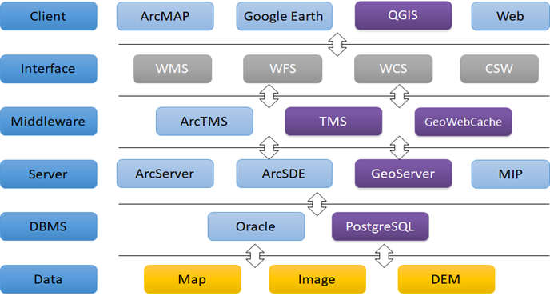
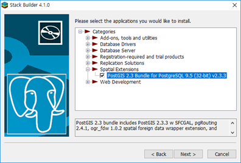

# 오픈소스 GIS 알아보기

> 오픈소스 GIS와 관련 FOSS4G SW 라이선스, 스택 구성에 대해 배워보겠습니다.

- [오픈소스 소프트웨어란 무엇인가](#오픈소스-소프트웨어란-무엇인가)
- [오픈소스 SW 라이선스 종류와 특징](#오픈소스-SW-라이선스-종류와-특징)
- [FOSS4G Stack 구성 이해](#FOSS4G-Stack-구성-이해)
- [실습에 필요한 SW 설치](#실습에-필요한-SW-설치)

 

## 오픈소스 소프트웨어란 무엇인가

오픈소스 운동가들은 소프트웨어를 인간세상을 발전시킬 수 있는 문화유산으로 생각하고 누구나 사용할 수 있는 공공재로 만들려 합니다.

https://www.youtube.com/watch?v=IeTybKL1pM4

 

오픈소스는 좋은 예가 훈민정음 입니다.

출처: https://i.ytimg.com/vi/kBDv_XhgsGA/maxresdefault.jpg

 

누가 만들었는지도 분명하고, 많은 노력이 들어 있습니다. 누구나 무료로 사용할 수 있게 공개 되어 있습니다. 이를 바탕으로 많은 문화가 발전했으며, 지금 이 강의도 진행할 수 있습니다.

 

오픈소스 소프트웨어는 흔히 FOSS (Free & Open Source Software)라 불립니다.
이 중 공간정보 오픈소스 소프트웨어는 FOSS4G (FOSS for Geospatial)라고 구별해 부르기도 합니다.

FOSS는 보통 다음과 같은 특징이 있습니다.
-	특정 라이선스에 따라 소프트웨어의 소스코드가 공개되어 있음
-	일반적으로 FOSS 사용자는 소프트웨어에 대한 자유로운 이용, 복사, 수정 및 재배포의 권한을 부여받음
-	FOSS를 사용해 발생하는 문제는 저작자가 아닌 사용자의 책임임
-	FOSS를 사용해 생산한 데이터 등은 사용자에게 권한이 있음
-	FOSS의 Free는 ‘공짜’를 의미하는 것이 아니라, 사용자가 소스코드에 접근하고 프로그램을 사용, 수정, 재배포 할 수 있는 ‘자유’를 의미함
-	FOSS는 개방형 표준(Open Standard)과는 다른 의미임. 하지만 일반적으로 FOSS는 국제적인 표준을 따르는 경향이 있음 (OGC와 OSGeo는 다른 조직)

오픈소스 소프트웨어의 자유는 다음과 같은 의미를 지닙니다.
-	Freedom of Use
-	Freedom of Copy
-	Freedom of Modify
-	Freedom of Redistribute

 

오픈소스 소프트웨어에 대한 오해들을 살펴봅시다.

### 오픈소스는 공짜?
-	오픈 소스 자체는 공짜지만,
-	오픈 소스를 제공하는 서비스(활용 및 개발, 유지보수 등)는 공짜가 아님.
-	초콜릿 만드는 레시피가 공짜라고 초콜릿도 공짜는 아님!
-	심지어 오픈소스를 돈받고 팔고 이를 보증하는 회사도 많음.

### 오픈소스는 외산?
-	외산이라기보다는 지구산이라는 표현이 더 정확할 듯.
-	국내 개발자들의 참여도 많이 늘어나고 있고,
-	오픈 소스를 활용하여 국내에서 개발한 서비스들도 늘어 나고 있음.
-	국산 소프트웨어라도 개발도구들은 외산이 주를 이룸(Eclipse, Microsoft Visual Studio).

### 오픈소스는 품질이 낮다?
-	과거에는 오픈 소스의 품질이 떨어지는 경우가 있었으나,
-	요즘은 많은 훌륭한 개발자들이 오픈 소스에 헌신을 하며 개발을 주도하고 있고,
-	다양한 분야에서 전문적인 오픈 소스 소프트웨어들이 상용 소프트웨어 못지 않은 품질로 출시되고 있음.

### 오픈소스는 보안에 취약하다?
-	소스 코드가 공개되어 있다고 시스템 자체의 보안이 취약해지지는 않음.
-	보안이 중요한 미국 국방부에서도 오픈 소스를 활발히 사용하고 있고,
-	시스템의 보안은 소스 코드 공개의 유무보다는 하드웨어나 소프트웨어적으로 방화벽이나 보안 코드(패킷 등의 암호화)의 사용여부 등이 더욱 중요함.

### 오픈소스는 사용자 지원이 나쁘다?
-	서비스의 품질은 대체적으로 서비스 대가와 비례.
-	RedHat등은 오픈 소스 제품을 유료로 판매하면서 고객들에게 상당히 높은 수준의 서비스를 제공함.
-	상용 소프트웨어 제품들도 서비스가 나쁜 경우가 종종 있음.

 

## 오픈소스 SW 라이선스 종류와 특징

라이선스(license, 사용허가권)는 저작권(Copyright)과는 다른, 저작자가 저작물을 사용하는 사람들에게 특정 목적 혹은 방식으로만 사용하게 제한하는 것입니다.

소프트웨어 라이선스는 생각보다 다양하고 각 라이선스 별로 특징과 주의점이 있습니다.

출처: http://www.oss.kr

-	소스코드를 공개하지 않는 소프트웨어들은 본 강의에서는 다루지 않습니다.
-	오픈소스 소프트웨어는 반드시 앞에서도 살펴본 4가지 자유인 자유로운 이용, 복사, 수정 및 재배포의 권한을 만족해야 합니다만, 조건에 따라 제한이 있을수도 있습니다.
-	먼저 소스코드를 고친 경우 이를 공개할 의무가 ‘반환의무’ 입니다.
-	또한 반환의무가 있는 경우에도 배타적 특허를 주장할 수까지 없는 경우도 있습니다.
-	사용형태가 서비스인지, 라이브러리인지, 소스코드를 수정해 사용하는지에 따라 제한이 달라지기도 합니다.

제한을 중심으로 주요 오픈소스 라이선스를 구분해 보면 다음과 같습니다.

### 거의 아무런 제한이 없는 라이선스
- MIT 라이선스
- 라이선스 안내문구를 포함해 배포하여야 함

### 고쳐서 배포해도 소스코드 반환의무 없는 라이선스
- BSD, Apache 라이선스
- 원 소스를 고쳐 공여하는 것은 무조건 원 라이선스를 따름

### 라이브러리로 사용시 반환의무 없는 라이선스
- LGPL, MPL, EPL 라이선스
- 라이브러리를 바이너리로 링크하여 사용시 소스공개 안해도 됨
- 라이브러리 소스를 수정해 사용한 경우 라이브러리 소스만 공개하면 됨

### 라이브러리로 사용하거나 소스 수정시 반환의무 있는 라이선스
- GPL 라이선스
- 수정하지 않고 그대로 소프트웨어로 사용시 반환의무 없음
- 라이브러리로 링크해 프로그램 개발시에도 전체 소스 반환의무 발생
- 원 소스 수정해 배포시에도 반환의무 발생
- 원 소스 수정하거나 이용해도 배포하지 않고, 서비스로 이용시 반환의무 없음

### 서비스로 사용해도 반환의무 있는 라이선스
- AGPL 라이선스
- 서비스로 혹은 서버로 사용시에도 반환의무 발생
- 이 경우도 그냥 배포 안하고 내부적으로 사용시 반환의무 없음

상세한 내용은 오픈소스 라이선스 종합정보시스템 사이트를 참고하세요.
https://olis.or.kr/ 

 

우리가 많이 사용하는 오픈소스 소프트웨어들의 라이선스는 다음과 같습니다.
- Linux GPL 라이선스
- PostgreSQL BSD 라이선스
- PostGIS GPL2 라이선스
- GeoServer GPL 라이선스
- GeoTools LGPL 라이선스
- QGIS GPL2 라이선스
- GDAL MIT 라이선스
- UDig EPL 라이선스
- OpenLayers BSD 라이선스
- Apache Web Server (HTTPD) Apache 라이선스

 

 

## FOSS4G Stack 구성 이해

GIS 서비스를 위해서는 보통 여러 계층의 여러 소프트웨어가 연결되어 구성됩니다.
이를 Stack이라 부릅니다.

 

위의 소프트웨어 혹은 인터페이스들 중 보통 사용자가 각 계층에서 선택하여 서비스 구성이 가능합니다.

독점적 상용 소프트웨어 만으로 서비스가 구성되기도 하고,  오픈소스 소프트웨어 만으로 서비스가 구성되기도 하고, 때로는 오픈소스와 독점 소프트웨어가 섞여 구성되기도 합니다.

각 소프트웨어는 완전히 독립적이지만, 네트워크와 이를 통한 인터페이스로 연결되어 서비스가 구성됩니다. 이런 연결은 보통 OGC라는 공간정보표준 국제단체에서 정의한 표준 인터페이스를 통해 가능하게 됩니다. 과거에는 ArcGIS 시리즈 등 독점 소프트웨어들은 이런 국제표준을 준수하지 않고 독자적인 인터페이스를 제공했지만, 이제는 대부분 국제표준 인터페이스도 지원하는 방향으로 발전되었습니다.

오픈소스의 경우에는 혼자 개발할 수 없는 경우가 일반적이라 표준인터페이스를 잘 준수하는 경우가 대부분입니다.

 

많이 사용하던 ArcGIS 제품들에 대응되는 대표적인 오픈소스 제품은 다음과 같습니다.

 

공간정보 오픈소스 스택에는 이 밖에도 다른 소프트웨어들이 많이 있습니다.
OSGeo Live를 둘러보세요. 

https://live.osgeo.org/

 

## 실습에 필요한 SW 설치

 

### QGIS

- 서비스용은 아니지만 데이터를 확인할 때 사용합니다.
- https://qgis.org/ko/site/forusers/download.html
- 보통 64 비트를 사용합니다.
- 설치관리자로 쉽게 설치할 수 있습니다.
- 예제는 안설치해도 됩니다.
- OS X, Linux, BSD, 안드로이드용 버전도 있습니다.

 

### PostgreSQL

- 공간정보를 저장하는 PostGIS의 기반이 되는 DBMS입니다.
- https://www.enterprisedb.com/downloads/postgres-postgresql-downloads#windows
- PostgreSQL, Windows x86-64 버전을 받아 설치합니다.
- Superuser(postgres) 암호로 postgres를 입력합니다. 실습을 위해 통일합니다.
- BigSQL 배포본으로 설치시 PostGIS가 설치 어려우니 EDB 배포본으로 설치하는 것이 좋습니다.

 

### PostGIS

- PostgreSQL의 버전에 맞는 버전 설치가 필수입니다.
- PostgreSQL 설치 마지막 단계의 Stack Builder로 설치 가능합니다.
- Spatial Extension 밑의 PostGIS 을 선택해 설치합니다.
- 샘플 DB 만들기 옵션을 선택하는 것이 좋습니다.	 

 

### Notepad++

- 텍스트 설정파일을 편집하고 웹코딩도 합니다.
- https://notepad-plus-plus.org/downloads/v7.9.5/

 

The End