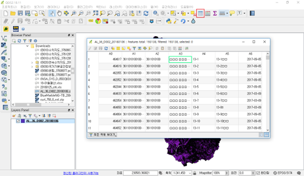
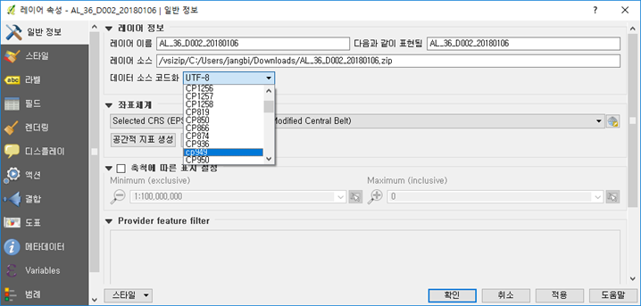

# 공간데이터 다루기 (QGIS)

<br>

> 양질의 공간데이터를 확보하고 확인하는 방법을 알아보겠습니다.

- [세계지도 데이터 받기](#세계지도-데이터-받기)
- [국토지리정보원 데이터 받기](#국토지리정보원-데이터-받기)
- [지적도 등 국가공간정보포털 자료 받기](#지적도-등-국가공간정보포털-자료-받기)
- [기타 쓸만한 데이터 확보처](#기타-쓸만한-데이터-확보처)
- [한글 코드페이지 알아보기](#한글-코드페이지-알아보기)
- [좌표계 알아보기](#좌표계-알아보기)
- [GeoPackage를 통해 보는 발전방향](#geopackage를-통해-보는-발전방향)

<br><br>

## 세계지도 데이터 받기

오픈된 세계지도 자료 중 가장 유명한 것은 [Natural Earth](http://www.naturalearthdata.com)입니다. 벡터와 래스터로 행정구역, 도로, 수계 등 쓸만한 전세계 데이터를 받을 수 있습니다. 우리는 이 Natural Earth 데이터를 가지고 QGIS에서 스타일링까지 해둔 자료를 바로 받겠습니다.<br>
http://naciscdn.org/naturalearth/packages/Natural_Earth_quick_start.zip

자료가 커 시간이 오래 걸리니 미리 받아두세요. QGIS에서 받은 자료를 열면 다음과 같이 보입니다.


<br>

## 국토지리정보원 데이터 받기

오픈데이터를 제공하는 국토정보플랫폼에서 내가 원하는 지역 수치지도를 다운로드 받아보도록 하겠습니다. 일단, 아래 공식 홈페이지에 접속합니다.<br>
국토정보플랫폼 홈페이지: http://map.ngii.go.kr/mn/mainPage.do


<br>

'수치지도'를 선택하면 아래와 같이 국토정보맵이 실행됩니다. 자료를 받기 위해 가입하고 로그인을 합니다.


<br>

'세종시'를 검색해 봤습니다. '세종시'를 검색하고, 목록에서 '세종특별자치시'를 클릭합니다.


<br>

수치지도는 수치지형도 (DXF 파일), 수치지형도Ver2.0 (NGI 파일), 연속수치지형도 (SHP 파일), 기본공간정보(SHP 파일), 토지특성도(SHP 파일), 토지이용현황도(SHP파일) 연안해역기본도(SHP파일)이 있습니다. 여기서는 수치지형도 (DXF 파일), 온맵을 다운로드 받겠습니다.


<br>

수치지형도를 클릭하여 [대전002]36710002를 체크하고 다운로드 받습니다.


<br>

다음과 같은 화면에서 생년월일, 사용목적을 작성하고 동의합니다 체크한 다음 다운로드


<br>

전체 다운로드 클릭하여 다운로드를 받습니다.


<br>

각 수치지도 유형의 차이는 다음 그림을 참고하세요.


이미지 출처: [전자도서] 국가지도의 이해와 활용(2016)<br>
https://www.ngii.go.kr/kor/contents/view.do?sq=631&board_code=contents_data

<br><br>

## 지적도 등 국가공간정보포털 자료 받기

국가공간정보포털에서도 많은 양질의 공간자료를 받으실 수 있습니다. 국가중점개방데이터가 대표적이며 이 중에서도 연속지적도, 용도지역지구정보 등이 많이 이용됩니다.

이번 실습에서는 연속지적도를 받아보겠습니다. 먼저 국가공간정보포털에 접속합니다.<br>
http://www.nsdi.go.kr/lxportal/?menuno=2679

그리고 아이콘이 모여있는 중앙의 국가중점개방데이터 아이콘을 누릅니다.


<br>

리스트의 가장 하단으로 가 부동산 개방데이터(15년)의 연속지적도정보의 [SHP] 버튼을 누릅니다.


<br>

시도에서 세종특별자치시를 선택하고 [조회]를 누릅니다. 검색되어 나온 리스트에서 가장 최신 데이터의 [SHP] 버튼을 눌러 자료를 받습니다.


<br>

국가중점개방데이터들은 대부분 이처럼 로그인 없이 받을 수 있습니다. 하지만, 국가공간정보포털의 다른 자료들은 가입하고 로그인 해야만 받을 수 있는 경우가 많습니다.

<br><br>


## 기타 쓸만한 데이터 확보처

<br>

전세계 위성영상도 쉽게 받을 수 있습니다. NASA에서 Blue Marble 이라는 이름으로 위성영상과 지형등의 자료로 각 월별 영상을 잘 만들어 두었습니다.<br>
https://neo.gsfc.nasa.gov/view.php?datasetId=BlueMarbleNG-TB

<br>


File Type으로 GeoTIFF를 선택하고 0.1 degrees 영상을 다운 받습니다.

<br><br>

기타 사이트는 목록만 보도록 하겠습니다.

<br>

### 공공데이터포털
https://www.data.go.kr
- 가장 많은 종류의 데이터를 제공하며, 대부분의 공공기관 데이터 공개 지원
- 가입 후 파일, Open API 등을 이용해 활용 가능

### 국가통계포털
https://kosis.kr
- 국내외 통계 데이터를 행정구역단위로 엑셀, CSV, 텍스트 등으로 다운로드

### 통계지리정보
https://sgis.kostat.go.kr
- 가입 필수
- 집계구, 통계지역경계(시도/시군구/읍면동/도시화지역,도시권경계 등), 센서스지도(하천, 건물, 도로, 철도, 등고 등) 신청 후 다운로드

### 건축데이터 민간개방 시스템
https://open.eais.go.kr
- 가입 필수
- 건축물 인허가정보, 건축물대장정보 제공

### 도로명주소 안내시스템
https://www.juso.go.kr
- 매칭테이블 및 주소변환서비스, API 등은 이 사이트를 통해 제공

### 국가교통DB센터
https://www.ktdb.go.kr
- 가입 필수
- 도로네트워크, 철도 등 교통주제도, OD 등 자료 신청 후 수령

### 표준노드링크관리시스템
https://www.its.go.kr
- 가입은 필요없으며, 표준노드링크관리시스템에서 생산한 도로네트워크 다운로드

### 공간정보오픈플랫폼
https://www.vworld.kr
- 가입 및 인증키 필수
- OGC 표준 스펙(WMS, WFS) 또는 Open API를 통해 웹에서 사용 가능

### 지방행정인허가데이터개방
https://www.localdata.go.kr
- 지방자치단체가 보유, 관리하는 생활관련 데이터의 개방
- 일반음식점, 관광업소 등 우선 개방, 이후 의료, 보건 등

### 공동주택관리정보시스템
http://www.k-apt.go.kr
- 공동주택 단지정보 및 관리비, 회계감사 등

### 부동산공시가격알리미
https://www.realtyprice.kr
- 표준지공시지가, 개별공시지가 검색
- 개별, 표준, 공동주택가격 검색

### 토양지하수 정보시스템
https://sgis.nier.go.kr
- 토양측정망, 지하수 수질측정망, 골프장 농약사용량 주소정보로 제공

### 지방자치단체 공공데이터 포털
- 서울 열린 데이터 광장(https://data.seoul.go.kr)
- 부산 공공데이터포털(https://data.busan.go.kr)
- 경기도 공공데이터 개방포털(https://data.gg.go.kr)
- 경상북도 공공데이터포털시스템(https://gb.go.kr/Main/open_contents/section/datastat)
- 전북 빅데이터 허브(https://www.bigdatahub.go.kr)
- 제주데이터허브(https://www.jejudatahub.net)
- 수원시 빅데이터 포털(https://data.suwon.go.kr) 등

### OpenStreetMap(OSM)
https://www.openstreetmap.org
- 가장 인기있는 참여형 지도제작 플랫폼 및 데이터
- ODBL 라이선스에 따라 사용
- Open API 또는 데이터 직접 다운로드가 가능하며, QGIS에서 직접 Import도 가능

### EarthExplorer
https://earthexplorer.usgs.gov
- USGS EarthExplorer
- 다양한 전세계 위성영상을 받을 수 있음

### ASTER GDEM
https://asterweb.jpl.nasa.gov
- 전세계 30m 해상도 DEM 제공
- 가입 후 도엽별로 선택하고 신청 후 인증 - 사이트 바로가기

### SRTM(Shuttle Radar Topography Mission
https://www2.jpl.nasa.gov/srtm
- 30m(일부지역) ~ 500m 등 다양한 해상도의 전세계 DEM 제공

### NASA’s Socioeconomic Data and Applications Center (SEDAC)
https://sedac.ciesin.columbia.edu
- Socioeconomic data (agriculture, climate, conservation, governance, hazards, health, infrastructure, land use, marine and coastal, population, poverty, remote sensing, sustainability, urban and water)

### UNEP Environmental Data Explorer
https://unepgrid.ch
- Freshwater, population, forests, emissions, climate, disasters, health and GDP spatial and non-spatial data.


<br><br>

## 한글 코드페이지 알아보기

<br>

우리가 겪을 수 있는 한글 코드페이지 문제를 해결해 봅시다. QGIS에서 아까 받은 세종시의 지적도를 열어보겠습니다.

QGIS를 열고 Browser Panel에서 앞에서 다운로드 받은 AL_36_D002_20180106.zip 파일을 찾아 더블클릭합니다.
그러면 자동으로 Layers Panel에 지적도가 들어오며 열립니다. zip 파일 안에 하나의 레이어만 들어온 경우 압축을 풀지 않아도 이렇게 잘 열립니다.


<br>

이제 한글 문제를 확인해 보겠습니다. 툴바에서 표모양 아이콘인 ‘속성 테이블 열기’ 아이콘을 눌러 지적도의 속성을 확인해 봅시다. 예시와 같이 한글이 있을 것 같은 컬럼이 정상적으로 보이지 않고 깨져 보이는 경우를 만날 수 있습니다.



<br>

이 경우 Layer Panel에서 해당 레이어 AL_36_D002_20180106 를 오른쪽 마우스로 선택하고 [속성] 메뉴를 선택합니다.


<br>

레이어 속성 창에서 일반정보 탭을 선택하고 '데이터 원본 인코딩'  항목에서 UTF-8로 된 부분을 cp949(windows-949 또는 EUC-KR)로 바꾼 후 [확인] 버튼을 눌러 창을 닫습니다.



<br>

다음과 같이 보인다면 인코딩 설정이 정상인 것이다.


<br>

작성된 자료에 맞게 코드페이지를 변경해 한글이 잘 보이게 한 것입니다. ‘데이터 원본 인코딩’라는 용어가 ‘코드페이지 설정’의 다른(?)용어입니다.

최근 국제표준은 모든 자료교환시 문자셋 즉 코드페이지에 의한 문제를 없애기 위해 UTF-8을 쓰도록 권장 하고 있습니다. 지적도의 올바른 코드페이지 였던 CP949도 역시 윈도우 OS에서 사용중인 우리나라 표준이고 국제표준이기도 하지만, 최근에는 이런 문자셋의 문제를 줄이기 위해 UTF-8을 사용할 것을 권장하고 있습니다.

맥 컴퓨터의 OS인 OS X, Linux 등에서는 UTF-8이 기본 문자셋이며, 웹문서도 UTF-8로 저장하는 것이 표준입니다. QGIS 뿐 아니라 최근 버전의 ArcGIS에서도 자료 저장 시 기본적으로 UTF-8을 사용하도록 되어 있습니다.

이렇게 한글이 들어간 자료를 다룰 때에는 코드페이지를 잘 확인하는 것이 매우 중요합니다. 문자셋과 코드페이지는 거의 비슷한 개념이며, 쉽게 이야기 하자면 문자를 바이너리로 저장하는 규약을 의미합니다.

이것 하나만 기억합시다. 한글이 있는 자료는 꼭 한글이 정상적으로 보이는지 확인해야 하고, 정상적으로 안보이면 CP949로 바꾸어 보고, 그래도 안보이면 UTF-8로 바꿔보면 됩니다. 만약 이 두가지로 바꿔봐도 정상적으로 보이는 경우가 없다면, 자료를 구한 곳에 다시 달라고 하세요.

<br><br>

## 좌표계 알아보기

<br>

이제 많이들 어려워 하는 좌표계 문제를 해결해 봅시다. 우리가 받은 세종시의 여러가지 자료들을 아래 그림처럼 잘 맞게 겹치는 것이 목표입니다.


<br>

먼저 세종시 지적도를 좀 더 지적도처럼 표현해 보겠습니다. 지적도는 보통 붉은 색 선으로 많이 표현합니다. 

Layers Panel에서 AL_36_D002_20180106 레이어를 오른쪽 클릭해 [속성] 메뉴를 선택합니다. 스타일 탭을 선택하고, Fill 아래의 단순 채우기를 선택 후, 심볼 레이어 타입을 '외곽선: 단순 선'으로 바꿉니다. 마지막으로 선의 색상을 붉은 색으로 바꾸고 [확인]을 선택하시면 됩니다.


<br>

이제 지적도가 속이 빈 붉은 선으로 보입니다. 하지만, 단지 지적도만 띄워서는 위치가 잘 맞는지 확인이 어렵습니다. 지형도도 한번 같이 띄워서 확인해 보도록 하겠습니다.

국토정보플랫폼에서 받은 (B010)수치지도_36710002_2017_00000529522183.dxf 파일을 같이 열어보록 하겠습니다. Browser Panel에서 이 파일을 찾아 더블클릭하면 됩니다.

DXF에는 좌표계 정보가 없어 좌표계를 물어보는데, 국토지리정보원 지형도의 중부지방은 EPSG:5186 좌표계를 사용합니다. 좌표계 선택 화면의 필터에 'korea central'을 입력하면 중부원점 좌표계들이 보이는데 이 중 선택하시면 좀 쉽게 지정하실 수 있습니다.


<br>

좌표계 선택이 끝나면 읽어들일 레이어를 선택하는 화면이 나옵니다. DXF 파일의 레이어를 잘 인식하지는 못하고, 그냥 Point와 LineString으로만 나뉘는군요. 모두 선택하고 확인 하세요. 또 각 레이어별 좌표계를 물어보는데 아까와 동일하게 EPSG:5186 좌표계를 선택하시면 됩니다.


<br>

지적도와 지형도를 동시에 띄워보니 둘 다 세종시의 자료인데 엄청 떨어져 있을 수 있습니다. QGIS에게 좌표체계 잘 못 알려주었기 때문입니다.


<br>

레이어 중첩 시 어긋나 보이는 경우 아래 두 가지를 확인 바랍니다.

1. '매뉴 > 프로젝트 > 속성 > 좌표계' 에서 프로젝트 좌표계를 정의해주어야 합니다.


2. '레이어 > 속성 > 원본' 에서 각 레이별로 올바른 좌표계를 정의해주어야 합니다. 본 실습에서 지적도는 5186, 지형도는 5174입니다. 


항상 자료 수집 시, 좌표계를 확인해야 합니다.

<br>

인터넷 지도를 바탕에 깔아서 더 확인해 보겠습니다.

QGIS 메뉴에서 [플러그인 / 플러그인 관리 및 설치…] 메뉴를 선택합니다.
검색에 korea를 입력하면 한국 사용자의 필수 플러그인인 TMS for Korea 플러그인이 보입니다.
선택하고 [플러그인 설치] 해 주십시오.


<br>

설치가 끝나면 플러그인 관리자 창을 닫고, QGIS의 [웹 / TMS for Korea / Daum Maps / Daum Street] 메뉴를 선택합니다.


<br>

그리고 Layers Panel에서 Daum Street 레이어를 가장 아래에 가게 끌어다 놓고, 수치지도 레이어를 선택하여 [레이어 영역으로 확대] 하시면 아래 그림처럼 인터넷 지도와 자료들을 중첩해 볼 수 있습니다.


<br>

<b>더 알아보기 1</b>

우리가 만날 수 있는 좌표계 문제의 끝판왕인 아래와 같은 경우에 위치 맞추기를 해 보겠습니다.


베셀 타원체 좌표계를 사용하는 경우 수백미터 정도 위치가 틀리는 문제가 국내 자료에서 많이 생깁니다. 
원인은 2000년대 이전에 많이 사용하던 좌표계의 정보가 잘못된 것 때문입니다.
우리가 받은 지적도를 관리하는 KLIS 시스템이 EPSG:5174라는 좌표계를 사용중인데, EPSG:5174 좌표계가 Bessel 타원체를 사용하고 있어 문제가 됩니다.

올바른 좌표계 정보를 찾기위해 다음 웹 페이지로 가 보겠습니다. https://www.osgeo.kr/17

웹페이지에서 5174를 검색해 보면 올바른 좌표계 변환 계수 정보를 찾을 수 있습니다.
+towgs84 인자인데, 이 부분이 기본 값에는 누락되어 문제가 되고 있습니다.


```
+proj=tmerc +lat_0=38 +lon_0=127.0028902777778 +k=1 +x_0=200000 +y_0=500000 +ellps=bessel +units=m +no_defs +towgs84=-115.80,474.99,674.11,1.16,-2.31,-1.63,6.43
```

<br>

QGIS 메뉴에서 [설정 / 사용자 정의 좌표계] 메뉴를 선택합니다.


<br>

[+] 버튼을 눌러 새 좌표계를 만들 수 있도록 하고, 이름에 '5174 Fix' 입력 후, 매개 변수에 복사해 둔 값을 붙여넣어 줍니다. 이 때 출처정보가 복사된 것을 지워주셔야 합니다.
이제 지적도에 올바른 좌표계 정보를 지정해 주겠습니다.
Layers Panel에서 지적도 레이어를 선택하고, [속성] 메뉴를 선택해 레이어 속성 창을 띄웁니다.
일반정보 탭을 선택하고 좌표체계에서 방금 만든 5174 FIx 좌표계를 찾아 선택 후 [확인] 을 눌러 적용합니다.


<br>

<b>더 알아보기 2</b>

TMS for Korea를 설치하지 않고 다음과 같이 배경지도 추가 할 수 있습니다.

XYZ Tiles에서 마우스 오른쪽 버튼 누르고 New Connection을 클릭하고 URL에 아래 URL을 입력하면 됩니다.

- OSM : http://a.tile.openstreetmap.org/{z}/{x}/{y}.png
- Google :  http://mt0.google.com/vt/lyrs=m&hl=en&x={x}&y={y}&z={z}&s=Ga
- Vworld : http://xdworld.vworld.kr:8080/2d/Base/service/{z}/{x}/{y}.png


<br><br>


## GeoPackage를 통해 보는 발전방향

<br>

다음은 GeoPackage에 대해 알아보겠습니다. '확장자가 *.gpkg 입니다.'
먼저 '(B090)온맵_36710002.gpkg' 을 열어 보겠습니다. 탐색기에서 (B090)온맵_36710002.gpkg 파일을 끌어다가 QGIS에 놓아 보세요.


약 4.5 메가 정도의 크기이고, 여러 레이어와 정사영상까지 들어있는데 단 한개의 파일이네요!
ESRI Shape 처럼 한 레이어도 여러 파일이 아니고요!
이 GeoPackage는 QGIS에서 별도 플러그인 없이도 잘 열립니다.
좌표계도 물어보지 않고 위치도 정확히 맞네요.

GeoPackage는 현재 공간정보 전문가들이 강력히 추천하는 국제표준 공간정보 저장 포맷입니다.

<br>

GeoPackage에 대해 좀 더 자세히 알아보겠습니다.

GeoPackage는 OGC에서 정한 공간데이터 저장, 교환, 서비스를 위한 국제표준이며 ArcGIS 10.3, QGIS 2.10.1, GeoServer 2.5, GDAL 1.11, GeoTools 11 이상의 버전에서 사용할 수 있습니다.

관련 상세 정보는 다음 링크에서 찾으실 수 있습니다.
http://www.geopackage.org/

특징만 정리해 보겠습니다.
- ESRI Shape 처럼 여러 파일이 아닌 한개의 파일이면 된다.
- 한 파일에 여러 레이어를 담을 수 있다.
- 벡터 뿐 아니라 래스터 데이터도 담을 수 있다.
- 좌표계 정보 등의 메타데이터도 함께 담겨 혼란이 없다.
- 한 레이어에 2^64(약 1.8e+19) 개의 행을 담을 수 있다.
- 물리적으로 허용하면 파일크기 제한이 없다.
- 속성 컬럼의 이름 길이에 제한이 없다.
- 공간데이터가 없는 속성 테이블도 같이 담을 수 있다.
- 내부적으로 인덱스를 지원해 빠른 속도의 조회가 가능하다.
- 단지 교환용 포맷 뿐 아니라 직접 서비스에 사용해도 높은 성능을 낼 수 있다.

이렇게 좋은 포맷 안 쓸 이유 없겠지요?
아직 잘 알려지지 않은 듣보잡 포맷이라 불안해 하신다면, 그렇지 않다 자신있게 말씀드릴 수 있습니다.

사실 GeoPackage는 새로운 포맷이 아니라 스마트폰에서도 흔히 쓰는 SQLite라는 파일기반 DB에 공간정보를 담는 규약만 정의한 것입니다.
때문에 Java, C++, Python 등 대부분의 주요 언어에서 기본적으로 다룰 수 있는 오래 검증되고 흔히 쓰이고 있는 기술기반을 가지고 있습니다.

<br>

<b>더 알아보기</b>

국토지리정보원에서 받은 PDF 포맷의 지도인 온맵은 지형도에 정사영상까지 들어있는 매우 유용한 지도입니다. 
하지만, 위치정보를 담은 GeoPDF가 아닌 일반 출력용 PDF이기에 다른 공간자료와 중첩해 사용 하기 힘듭니다.
개발을 통해 이런 문제도 극복한 사례를 잠시 살펴보도록 하겠습니다. 

`QGIS2 으로만 가능합니다.` QGIS는 다른 버전을 같이 설치 및 사용 가능합니다.

다음 링크로 가 보겠습니다.
https://gaia3d.github.io/OnMapLoader/

온맵을 읽어 공간데이터로 변환시켜주는 플러그인인 OnMpaLoader 입니다.
공식 플러그인이 아니라 QGIS 플러그인 관리자로 바로 설치는 못하지만, 우리는 사용할 수 있습니다.

설치 안내에 나온 내용대로 해 봅시다. 우선 다음에서 설치를 위한 파일을 받습니다.
https://github.com/Gaia3D/OnMapLoader/raw/master/release/OnMapLoader_1.2.zip 

이를 사용자 폴더의 .qgis2/python/plugins에 압축을 풀어줍니다.
이 때 OnMapLoader 폴더가 2중으로 생기지 않도록 주의해야 합니다.


<br>

QGIS를 재실행 하면 OnMap 아이콘이 보입니다.

  

<br>

이 버튼을 누르면 온맵 PDF를 읽어 공간정보로 만들고 이를 GeoPackage라는 포맷으로 저장해 나중에 더 빨리 사용할 수 있게 해주는 OnMapLoader가 실행됩니다.


<br>

변환에 시간이 꽤 걸립니다. 다 변환이 되면 온맵에 있던 지형도와 정사영상이 QGIS에서 재위치에 올라오는 것을 확인할 수 있습니다.


<br>

The End