# 공간 DBMS 구축 (PostgreSQL + PostGIS)

<br>

> 이제 공간정보를 DBMS에 넣어 효과적으로 관리하는 방법을 배워보도록 하겠습니다.

- [PostGIS 도커 설치하기](#postgis-도커-설치하기)
- [공간 DBMS 준비하기](#공간-dbms-준비하기)
- [PostGIS에 공간정보 올리기](#postgis에-공간정보-올리기)
- [공간 SQL 실습](#공간-sql-실습)

<br>

## PostGIS 도커 설치하기

<br>

공간 DBMS를 - PostgreSQL + PostGIS - Docker Container 로 설치하겠습니다.
컨테이너 설치는 빠른 배포, 환경 일관성, 확장성에 강점이 있습니다. 
전역환경(Windows, Mac, Linux)에 설치 할 수도 있습니다.  

참고: https://postgis.net/documentation/getting_started/

<br>

Docker Desktop 을 설치하세요.  
https://docs.docker.com/desktop/setup/install/windows-install/

<br>

`명령 프롬프트`를 `관리자 모드`로 열고 WSL 버전을 확인하고, 업데이트 또는 설치 하세요:

```
wsl --version
```

```
wsl --install
```

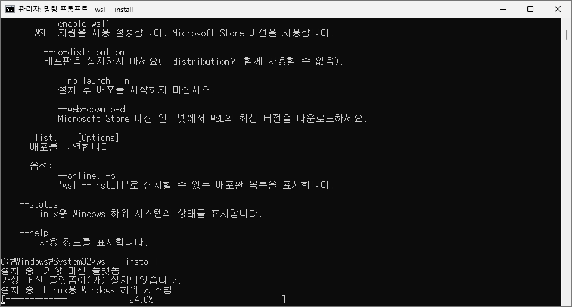
(WSL 설치가 끝나면, 시스템 재부팅일 필요합니다.)

<br>

<br>

`Docker Desktop for Windows - x86_64` 를 다운로드하고 설치하세요:

<br>

PostGIS( + PostgreSQL + pgAdmin) 컨테이너를 설치 할 새 폴더 `postgis' 를 다음과 같은 폴더 구조로 만드세요:

```
postgis
  /pgdata
  docker-compose.yml
```

<br>

Docker Compose 파일을 작성하세요:

> (참고)  
> https://hub.docker.com/r/postgis/postgis  
> https://hub.docker.com/r/dpage/pgadmin4

```
# docker-compose.yml

services:
  postgis:
    image: postgis/postgis:17-3.5 # PostgreSQL 17 + PostGIS 3.5
    container_name: postgis
    restart: unless-stopped
    environment:
      POSTGRES_USER: postgres
      POSTGRES_PASSWORD: postgres
      POSTGRES_DB: gisdb  # 디폴트 DB 이름
    ports:
      - "5432:5432"
    volumes:
      - ./pgdata:/var/lib/postgresql/data # (changed in PostgreSQL 18+) /var/lib/postgresql

  pgadmin:
    image: dpage/pgadmin4:8.14
    container_name: pgadmin
    restart: unless-stopped
    environment:
      PGADMIN_DEFAULT_EMAIL: admin@admin.com   # 로그인 이메일
      PGADMIN_DEFAULT_PASSWORD: admin          # 로그인 비밀번호
    ports:
      - "8070:80"   # 브라우저에서 http://localhost:8070 접속
    # volumes:
    #   - ./pgadmin:/var/lib/pgadmin
    depends_on:
      - postgis
```

<br>

컨테이너를 생성 및 실행하세요:

```
docker-compose up -d
```

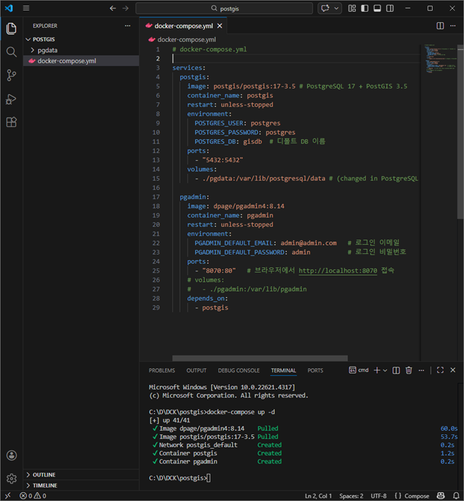

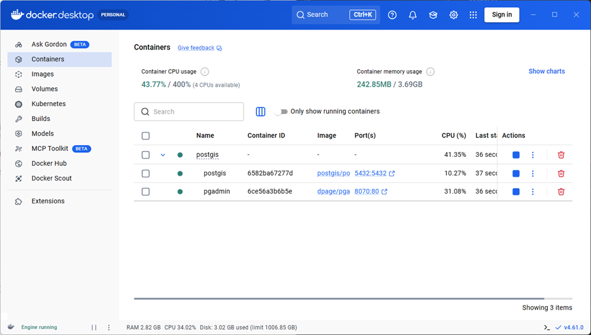

<br>

공간 DBMS를 확인해보세요: pgAdmin(http://localhost:8070) > 'Severs' > 'Register' > 'Server'

```
General > 
  Name: postgis
Connection > 
  Host name/address: postgis
  Port: 5432
  Username: postgres
```
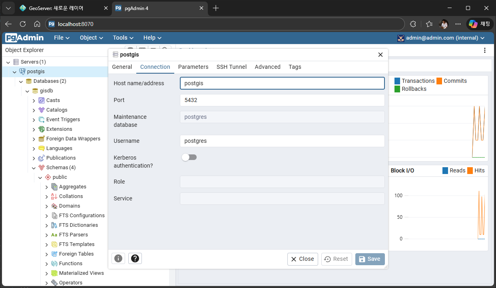

<br>

> 샘플데이터 정도는 ESRI Shape 파일로도 잘 서비스할 수 있지만, 상업적인 규모의 서비스를 하기 위해서는 공간정보를 지원하는 DBMS를 이용하는 것이 좋습니다. 공간 DBMS로 오늘 배우는 것은 PostGIS 이지만, 이 외에도 Oracle Spatial, MS SQL Server, MySQL, SpatialLite 등 여러가지 주요 DBMS가 공간정보를 다룰 수 있습니다.

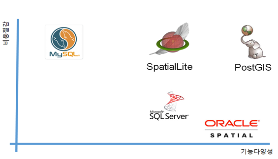

출처: https://www.slideshare.net/gis_todd/postgis-and-spatial-sql 

<br>


## 공간 DBMS 준비하기

<br>

먼저 PostgreSQL에 확장 기능인 PostGIS가 적용되도록 하겠습니다.

PostgreSQL을 관리하는 편리한 도구인 pgAdmin를 사용하겠습니다.
pgAdmin(http://localhost:8070) 을 실행하세요:

실습 암호는 `'postgres'` 입니다. 현업에서는 철저하게 보안 암호를 적용 바랍니다.

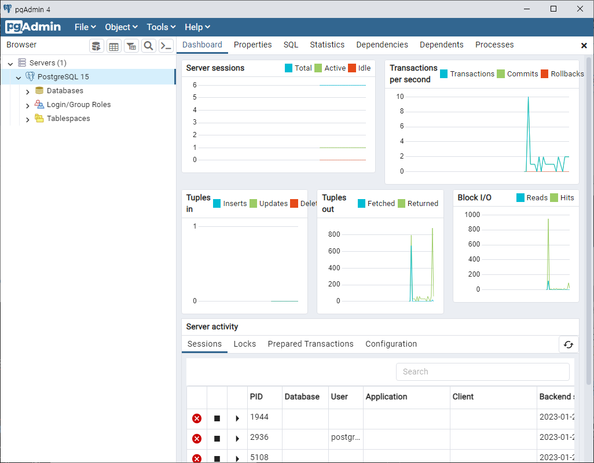

<br>

공간 DBMS를 만들어 보겠습니다. `'Databases'` 항목을 오른쪽 클릭하고 `'Create > Database...'` 메뉴를 선택합니다.

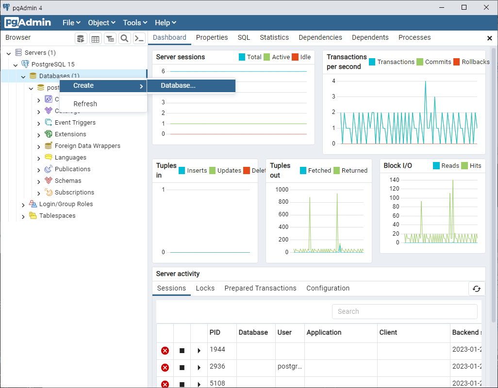

<br>

새로 만들 Database의 이름을 osgeo라 하겠습니다.
`Properties` 탭의 Name 항목에 osgeo를 입력해 주세요.
그리고 `Definition` 탭으로 가셔서 `Encoding: UTF-8, Template: template0, Collation: C, Character type: C` 를 선택하시고 [OK]를 눌러 주세요.
만약 Collation, Character type에 C가 아닌 다른 값을 선택하면 한글의 정렬과 검색에서 문제가 생길 수도 있으니 주의하세요.

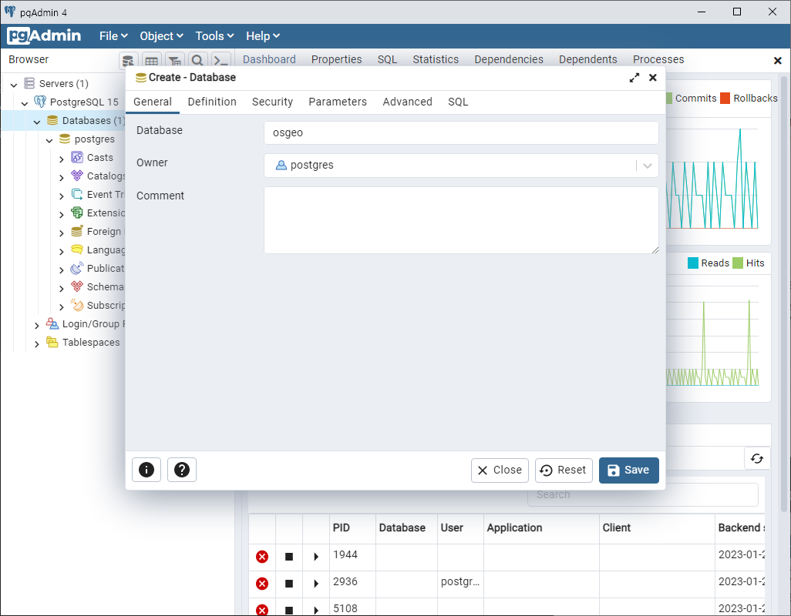

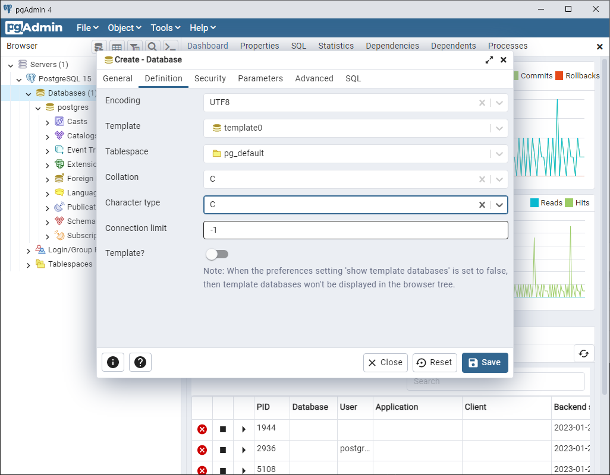

<br>

이렇게 만들어진 Database가 바로 공간자료를 다룰 수 있는 것은 아니고 한 단계를 더 거쳐야 합니다.
Databases 아래의 방금 만든 osgeo를 선택하고, [SQL] 버튼을 눌러 Query 창을 엽니다.

SQL Editor에 ```create extension postgis;```  라 입력하고 Run 버튼을 누르거나 [F5] 펑션키를 눌러 실행합니다.
이제 이 osgeo Database는 공간정보를 다룰 수 있게 되었습니다.

```
create extension postgis;
```

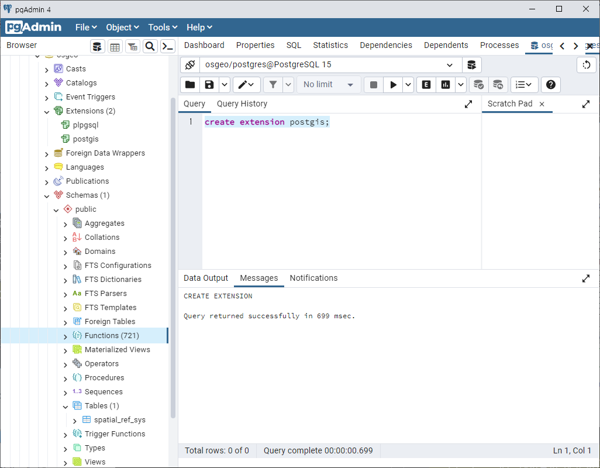

'Extensions'에 'postgis'가 들어가 있고, `'Schemas / public / Functions'` 에 펑션수가 700개가 넘게 되고, Tables에 `'spatial_ref_sys'` 라는 테이블이 생겨 있음을 보면, 아~ 공간정보를 담을 준비가 되었구나 하시면 됩니다.

<br>

spatial_ref_sys 테이블은 좌표계 정보를 담고 있는 매우 중요한 테이블입니다.
내용을 잠깐 살펴보겠습니다.
spatial_ref_sys 테이블을 선택 후 툴바에서 표 모양 아이콘을 누르면 내용을 볼 수 있습니다.
 
srid 컬럼에 숫자들이 보이고, auth_name에 EPSG라는 글자들이 보입니다. proj4text라는 컬럼에도 어디서 본 듯한 내용들이 들어있네요.
앞 시간에 배운 좌표계 정보가 들어 있다는 것을 느끼실 수 있지요?

QGIS에서 문제가 되었던 EPSG:5174 좌표계 정보를 조회해 보겠습니다.
Query 창에 SQL을 입력해 조회할 수 있습니다.
다음 SQL을 입력하고 실행해 봅시다.

```
select proj4text from spatial_ref_sys where srid = 5174;  
```

결과를 보면 여기서도 +towgs84 인자가 누락되어 있음을 확인할 수 있습니다.

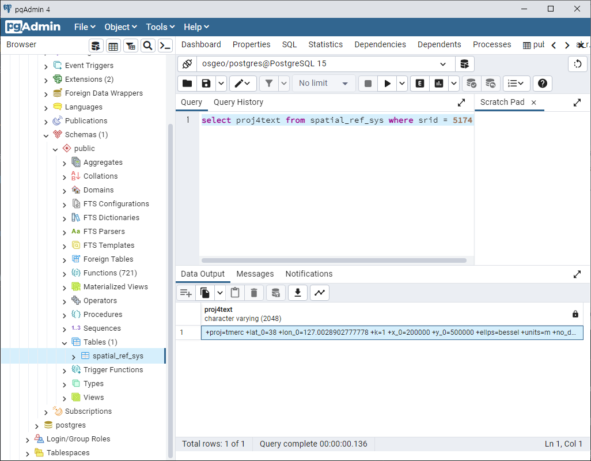

<br>

이를 바로잡기 위한 SQL이 미리 만들어져 있어 어렵지 않게 바로잡을 수 있습니다.
다음 링크로 가 보십시오.
http://www.osgeo.kr/205 


이 페이지에서 postgis_korea_epsg_towgs84.sql을 다운로드 받습니다.
Query 창에서 열기 버튼을 눌러 이 SQL 파일을 열고 [F5]눌러 실행하시면 됩니다.

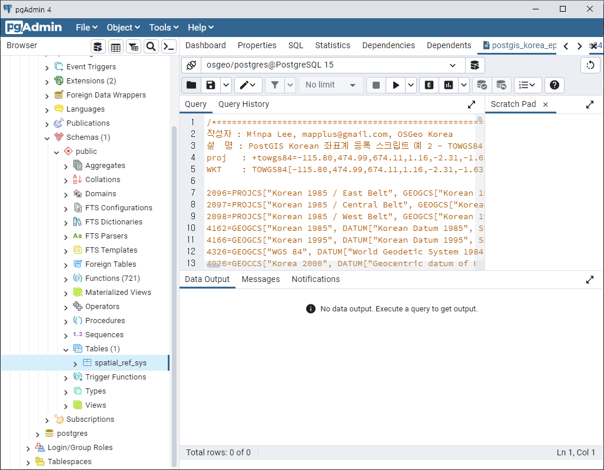

<br>

이제 PostGIS에서는 한국 좌표계들이 정상적으로 좌표계 변환이 됩니다.
이렇게 PostGIS를 활성화시키고 한국 좌표계를 정정하는 작업은 새로운 Database를 만들때만 하면 됩니다.


<br>


## PostGIS에 공간정보 올리기

<br>

공간 DBMS를 만들었으니 이제 공간정보를 올려보겠습니다.
먼저 실습에 사용할 파일을 받겠습니다.
다음 링크의 자료를 받아 주세요.   
https://github.com/Gaia3D/workshop/raw/master/20171208_%EC%84%9C%EC%9A%B8%EC%97%B0_%EA%B3%B5%EA%B0%84SQL/data.zip

다운로드 받은 자료를 C:\data 폴더에 풀어주세요.
먼저 한글 코드페이지를 확인해 보기 위해 QGIS에서 자료를 열어보겠습니다.
admin_emd를 열어보니 한글이 다 깨져 보이는군요. 
좌표계는 5186으로 확인됩니다.

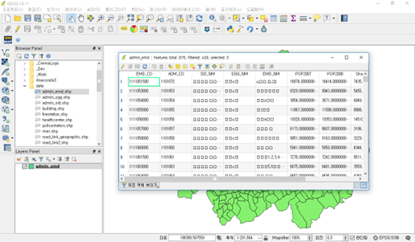

<br>

데이터 소스 코드화 값을 'windows-949(cp949 또는 ms949)'로 바꾸니 정상적으로 보입니다.
이 데이터들은 대부분 윈도우에서 사용하는 cp949 코드페이지를 사용하고 있습니다.

단 한 레이어만 코드페이지가 다른데, road_link_geographic 입니다. 좌표계도 4326입니다.

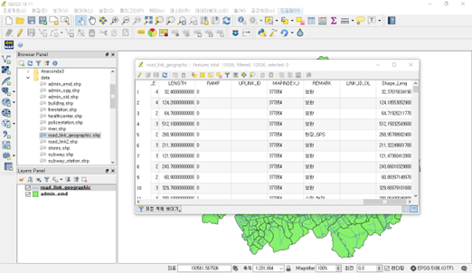

<br>

공간정보를 PostGIS에 올릴 수 있는 도구와 방법은 여러가지가 있습니다.
본 실습에서는 QGIS 뿐만 아니라 GDAL(ogr2ogr)을 활용한 방법까지 알아보겠습니다.

<br>

### QGIS 활용하여 PostGIS에 공간정보 올리기

<br>

`QGIS` 실행하고 `탐색기`에서 `PostgreSQL` 를 찾아서 마우스를 우클릭하여서 `새 연결`을 실행하세요.

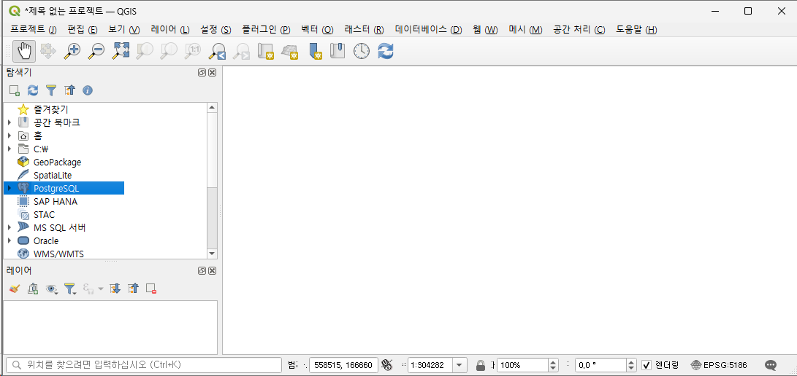

<br>

다음과 같이 연결 정보를 편집하고 `연결 테스트` 하세요.

```
이름: osgeo
호스트: localhost
포트: 5432
데이터베이스: osgeo
사용자: postgres
비밀번호: postgres
```

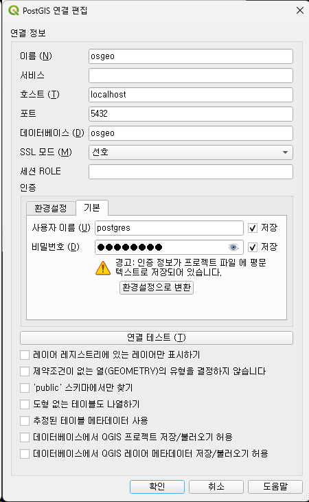

<br>

`매뉴 > 데이터베이스 > DB관리자` 실행하고, `제공자 > PostGIS > osgeo > public` 선택하고, `레이어/파일 불러오기` 실행하세요.  
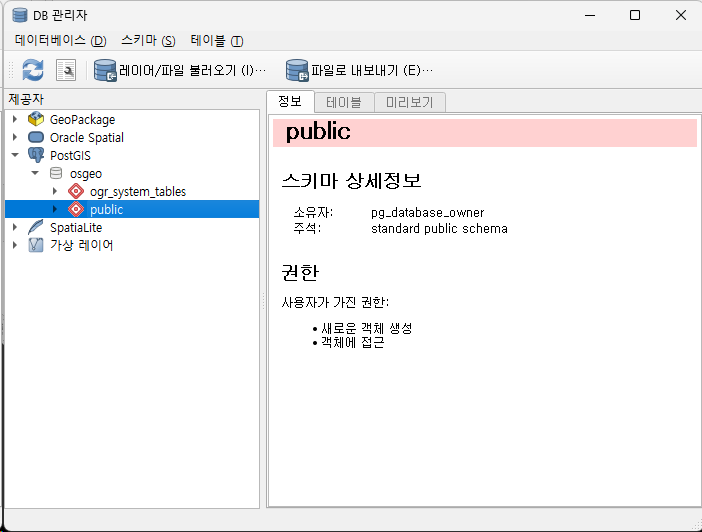

`입력: 가져올 파일`로 `/data/admin_emd.shp`을 선택하고, `확인`을 실행하세요.  
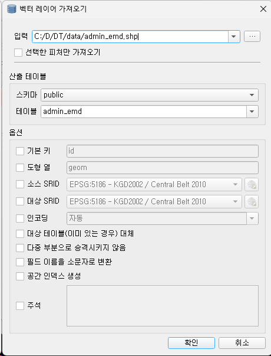

<br>

### QGIS 활용하여 PostGIS에 공간정보 여러개 올리기

<br>

`매뉴 > 공간 처리 > 공간 처리 툴박스`를 실행하세요. `PostgreSQL`을 검색하고, `PostgreSQL로 내보내기`를 실행하세요. `배치 프로세스로 실행`을 실행하세요.  
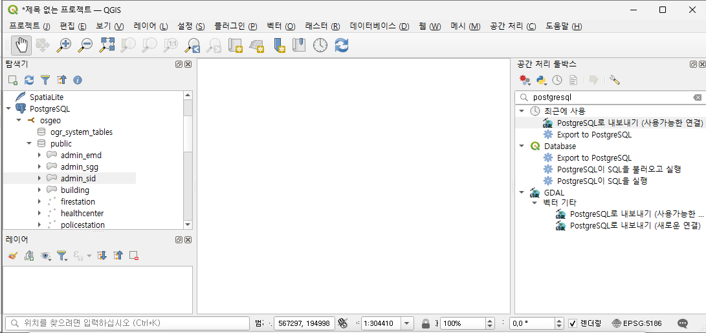

<br>

다음과 같이 편집하여 실행하세요.

```
데이터베이스(연결 이름): osgeo
입력레이어: /data/admin_sgg.shp | /data/admin_sid.shp
형태 인코딩: CP949
스키마: public
입력 속성의 너비 및 정확도 유지: X
```

주의! 입력 속성의 너비 및 정확도 유지를 해지하고 실행하세요.  
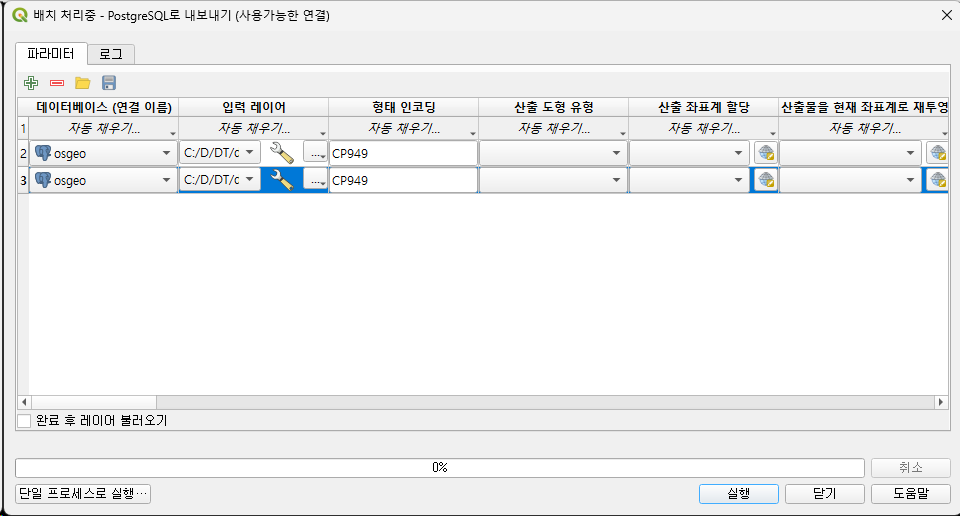  
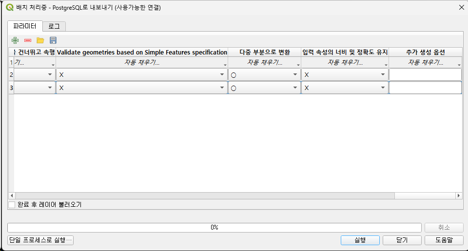

<br>

### GDAL(ogr2ogr) 활용하여 PostGIS에 공간정보 올리기

<br>

`QGIS > 탐색기 > PostgreSQL > osgeo > public` 에서 `admin_sid` 마우스 우클릭하여 `관리 > 삭제` 하세요.
`윈도우 키> OSGeo4W Shell` 을 실행하세요. 다음 명령어를 실행하여 레이어를 올리세요. `QGIS > 탐색기 > PostgreSQL > osgeo > public` 에서 `새로고침` 하세요.

```Bash
cd c:\data
```
```Bash
ogr2ogr -progress --config PG_USE_COPY YES --config SHAPE_ENCODING CP949 -f PostgreSQL "PG:dbname='osgeo' host=localhost port=5432 user='postgres' password='postgres'" -overwrite -nlt PROMOTE_TO_MULTI -lco GEOMETRY_NAME=geom -lco FID=id -lco PRECISION=NO admin_sid.shp -nln public.admin_sid
```

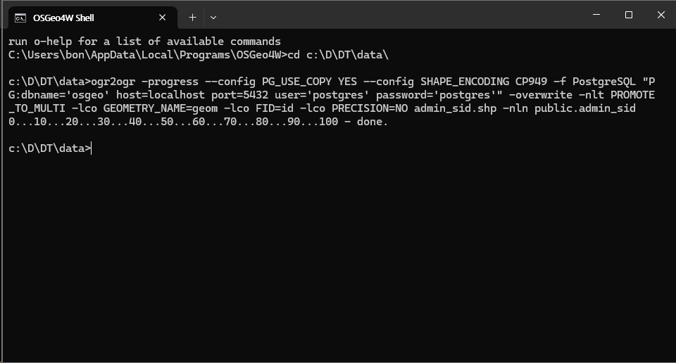

<br>

### GDAL(ogr2ogr) 활용하여 PostGIS에 공간정보 여러개 올리기

<br>

다음과 같이 배치파일을 작성하고 실행하여서 여러개의 공간정보를 PostGIS에 올리세요. 터미널(CMD)에서 한글 깨짐을 방지하기 위해서 CP949 또는 EUC-KR 로 설정하세요.


```Bash
@echo off
setlocal enabledelayedexpansion

:: 1. 사용자 설정
set OSGEO4W_ENV="C:\Users\bon\AppData\Local\Programs\OSGeo4W\bin\o4w_env.bat"
set DB_CONN="PG:dbname='osgeo' host='localhost' port='5432' user='postgres' password='postgres'"
set TARGET_SCHEMA=public
set SRID=5186
set ENCODING=CP949

:: OSGeo4W 환경 로드
if not exist %OSGEO4W_ENV% (
    echo [ERROR] OSGeo4W 환경 파일을 찾을 수 없습니다: %OSGEO4W_ENV%
    pause
    exit /b
)
call %OSGEO4W_ENV%

echo ">>> Batch Import Started..."

:: 2. 모든 .shp 파일 루프 실행
for %%f in (*.shp) do (
    set FILE_NAME=%%f
    set TABLE_NAME=%%~nf

    echo.
    echo [Processing] !FILE_NAME! ---^> %TARGET_SCHEMA%.!TABLE_NAME!

    ogr2ogr -progress ^
--config PG_USE_COPY YES ^
--config SHAPE_ENCODING %ENCODING% ^
-f PostgreSQL %DB_CONN% "%%f" ^
-nln %TARGET_SCHEMA%.!TABLE_NAME! ^
-overwrite ^
-nlt PROMOTE_TO_MULTI ^
-s_srs EPSG:%SRID% ^
-t_srs EPSG:%SRID% ^
-lco GEOMETRY_NAME=geom ^
-lco FID=id ^
-lco PRECISION=NO

    if !errorlevel! equ 0 (
        echo [SUCCESS] !TABLE_NAME! 테이블 생성 완료.
    ) else (
        echo [FAILED] !FILE_NAME! 임포트 중 오류 발생.
    )
)

echo.
echo ">>> All files processed."
pause
```

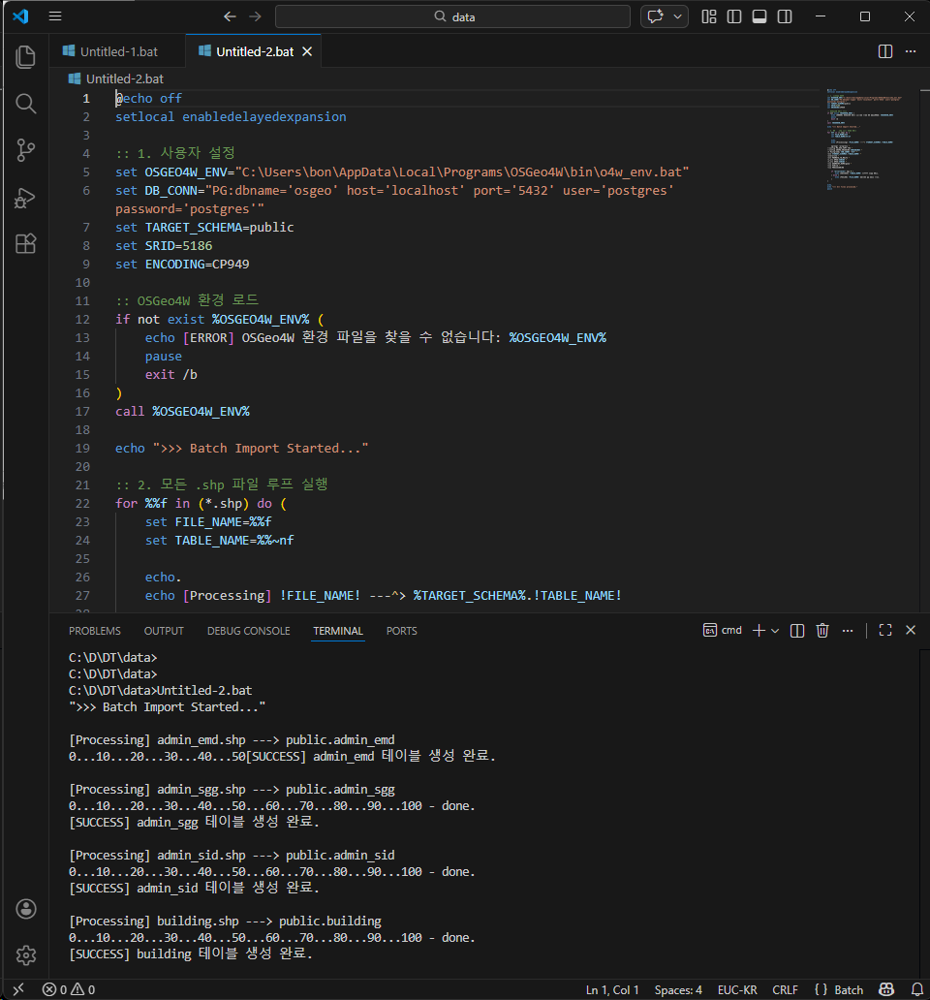

<br>

QGIS에서 `road_link_geographic` 레이어의 좌표체계 및 인코딩을 확인하고, 삭제 후 다시 업로드하세요.

```Bash
where /r C:\ o4w_env.bat
```

```Bash
C:\Users\bon\AppData\Local\Programs\OSGeo4W\bin\o4w_env.bat
```

```Bash
cd c:\data
```

```Bash
ogr2ogr -progress --config PG_USE_COPY YES --config SHAPE_ENCODING UTF-8 -f PostgreSQL "PG:dbname='osgeo' host=localhost port=5432 user='postgres' password='postgres'" -overwrite -nlt PROMOTE_TO_MULTI -lco GEOMETRY_NAME=geom -lco FID=id -lco PRECISION=NO road_link_geographic.shp -nln public.road_link_geographic -s_srs EPSG:4326 -t_srs EPSG:4326
```

<br>

## 공간 SQL 실습

<br>

먼저 간단한 일반 SQL 부터 시작해 보겠습니다.
pgAdmin으로 가서 새 Query 창을 띄우고 실습하시면 됩니다.
pgAdmin(http://localhost:8070) 을 실행하세요.

<br>

```sql
SELECT *
FROM stores;
```

매장들이 들어있는 store 테이블의 내용을 모두 보는 쿼리입니다.
공간데이터 컬럼이 어찌 보이는지는 한번 더 확인해 보세요.
혹시 빈칸처럼 보여도 실제로는 비어있지는 않습니다.

<br>

```sql
SELECT *
FROM stores
WHERE brand='이마트';
```

매장 중 이마트만 필터링해 보는 쿼리입니다.

<br>

```sql
SELECT COUNT(nam)
FROM stores
WHERE addr like '%영등포구%';
```

영등포구의 매장만도 간단히 필터링 할 수 있습니다.

<br>

```sql
SELECT brand, COUNT(nam) as "점포수"
FROM stores
GROUP BY brand;
```

각 브랜드별 점포수를 조회하기 위해 집계 함수인 COUNT를 사용했습니다.
집계함수를 사용할 때는 보통 GROUP BY 문이 필요합니다.

<br>

```sql
SELECT brand, AVG(char_length(nam)), STDDEV(char_length(nam))
FROM stores GROUP BY brand;
```

평균과 분산을 구하는 정도는 DB에게는 일도 아니지요.

<br>

```sql
SELECT ST_AsText(geom)
FROM firestation;
```

드디어 공간 SQL입니다. 지오메트리를 텍스트로 만들어 사람이 알아볼 수 있는 형태로 조회했네요.
ST_로 시작하는 함수가 공간 SQL을 위한 함수입니다.

<br>

```sql
SELECT link_id, ST_Length (geom)
FROM road_link_geographic;
```

길이를 구하는 것 쯤이야 쉽지요.

<br>

```sql
SELECT link_id, ST_Length(ST_Transform(geom,5179))
FROM road_link_geographic;
```

하지만, 경위도 등 미터단위가 아닌 좌표계에서 거리나 면적을 계산하면 엉뚱한 값이 나옵니다.
이럴 때는 미터단위를 사용하는 좌표계로 변환하여 계산하면 됩니다.

<br>

```sql
SELECT ufid, ST_Area(ST_Transform(geom,5179))
FROM building
LIMIT 100;
```

면적도 어려울 것이 없지요. 
마지막 줄의 LIMIT 100은 결과중 100개만 보여주는 것인데, 자료량이 많을 때 테스트시 특히 유용합니다.
웹에서의 페이징 등의 조회기법을 위해서도 사용합니다.

<br>

```sql
SELECT ufid, ST_Area(geom)
FROM building
LIMIT 100;
```

하지만, 앞에서의 SQL에는 불필요한 좌표계 변환이 들어있습니다.
원 자료의 5186 좌표계도 미터단위 TM 직각좌표계고, 변환한 5179 좌표계도 미터단위 TM 직각좌표계여서 둘 좌표계가 타원체가 다르기는 하지만 면적 계산시에는 전혀 좌표계 변환할 필요가 없습니다.

<br>

```sql
ALTER TABLE stores
ADD Column buffer geometry(Polygon,4326);
```

기존 테이블에 공간데이터를 저장할 수 있는 컬럼을 추가하는 것도 쉽습니다.
이제 sotres 테이블은 한 행당 2가지 공간자료가 들어갈 수 있게 되었습니다.

<br>

```sql
UPDATE stores
SET buffer=ST_Transform(ST_Buffer(geom, 30), 4326);
```

이렇게 하면 방금 만든 buffer라는 컬럼에 실제로 30미터 버퍼를 만든 것을 경위도로 변환해 저장하게 됩니다.
만약 경위도로 들어오는 사람이나 자동차의 실시간 위치를 파악해 점포주변 30미터에 들어오면 쿠폰을 발송하는 등의 시스템을 만들려면 이렇게 자료를 다음어 두면 좋겠지요.

<br>

```sql
SELECT ST_AsGeoJSON(ST_Transform(geom, 4326))
FROM stores;
```
```sql
SELECT ST_AsGML(geom) FROM stores;
```

인터넷 상에서 자료를 교환할 때 보통 JSON이나 XML을 사용합니다.
공간정보를 위한 JSON이 GeoJSON이라는 표준이고, XML의 경우는 GML이란 표준입니다.

주의할 것은 위의 ST_AsGeoJSON, ST_AsGML 함수는 도형부분만을 반환하고 속성은 넣어주지 않는다는 것입니다. 실제로 교환시에는 아래 예처럼 속성까지 포함된 완전한 형태로 전달하도록 코딩해 주어야 합니다.

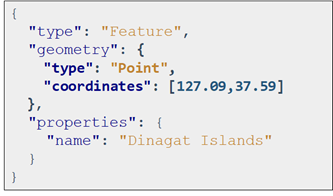
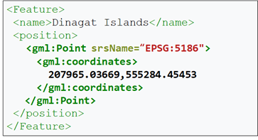

<br>

```sql
SELECT ST_NPoints(geom) as num_point
FROM road_link2
ORDER BY num_point DESC
limit 100;
```

도형이 몇 개의 점으로 이루어졌는지 등 도형에 관한 상세한 정보도 조회할 수 있습니다.

<br>

```sql
SELECT shop.nam as "매장명", metro.nam as "인근역"
FROM stores as shop, subway_station as metro
WHERE ST_Intersects(ST_Buffer(shop.geom, 500), metro.geom);
```

앞에서도 해 봤듯이 공간연산을 조건절에 추가해 공간을 기준으로 JOIN 할 수도 있습니다.

<br>

```sql
SELECT shop.nam as "매장명", metro.nam as "인근역"
FROM stores as shop, subway_station as metro
WHERE shop.addr LIKE '%영등포%'
AND ST_Intersects(ST_Buffer(shop.geom, 500), metro.geom);
```

공간연산 뿐 아니라 일반 속성에 대한 연산까지 추가해 더욱 효과적인 자료조회가 가능합니다.

<br>

본 강의에서 배우지 않는 강력한 공간 SQL 들이 많이 있습니다.
다음 링크의 PostGIS Reference에서 공간정보 함수들의 정보를 얻을 수 있습니다.   
https://postgis.net/documentation/manual/

<br>

The End

<br>

[> 처음으로](README.md)