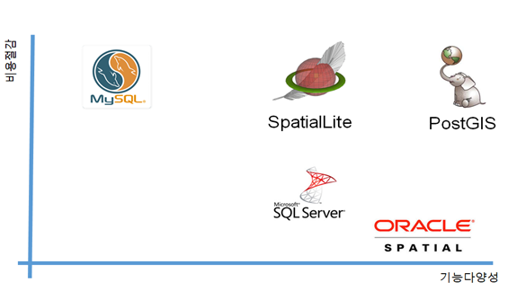
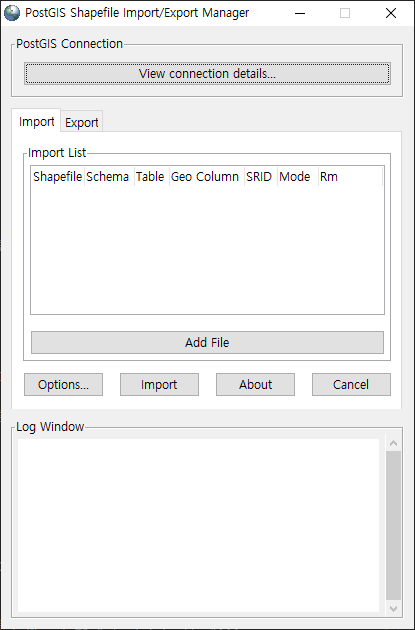

# 공간 DBMS 구축 (PostGIS)

<br>

> 이제 공간정보를 DBMS에 넣어 효과적으로 관리하는 방법을 배워보도록 하겠습니다.

- [공간 DBMS 준비하기](#공간-dbms-준비하기)
- [PostGIS에 공간정보 올리기](#postgis에-공간정보-올리기)
- [공간 SQL 맛보기](#공간-sql-맛보기)
- [공간 SQL 실습](#공간-sql-실습)
- [공간자료를 효과적으로 다루는 커맨드라인 명령어](#공간자료를-효과적으로-다루는-커맨드라인-명령어)

<br>

## 공간 DBMS 준비하기

<br>

샘플데이터 정도는 ESRI Shape 파일로도 잘 서비스할 수 있지만, 
상업적인 규모의 서비스를 하기 위해서는 공간정보를 지원하는 DBMS를 이용하는 것이 좋습니다.
공간 DBMS로 오늘 배우는 것은 PostGIS 이지만, 이 외에도 Oracle Spatial, MS SQL Server, MySQL, SpatialLite 등 
여러가지 주요 DBMS가 공간정보를 다룰 수 있습니다.



출처: https://www.slideshare.net/gis_todd/postgis-and-spatial-sql 

<br>

먼저 PostGIS의 기반 DBMS인 PostgreSQL에 확장 기능인 PostGIS가 적용되도록 하겠습니다.

PostgreSQL을 관리하는 편리한 도구인 pgAdmin를 사용하겠습니다.
[윈도우] 버튼을 누르고 pgadmin을 입력하면 쉽게 찾을 수 있습니다.
pgAdmin 버튼을 눌러 시작하십시오.

실습 암호는 'postgres' 입니다. 현업에서는 철저하게 보안 암호를 적용 바랍니다.


<br>

공간 DBMS를 만들어 보겠습니다. 'Databases' 항목을 오른쪽 클릭하고 'Create > Database...' 메뉴를 선택합니다.


<br>

새로 만들 Database의 이름을 osgeo라 하겠습니다.
Properties 탭의 Name 항목에 osgeo를 입력해 주세요.
그리고 Definition 탭으로 가셔서 Encoding: UTF-8, Template: template0, Collation: C, Character type: C 를 선택하시고 [OK]를 눌러 주세요.
만약 Collation, Character type에 C가 아닌 다른 값을 선택하면 한글의 정렬과 검색에서 문제가 생길 수도 있으니 주의하세요.


<br>

이렇게 만들어진 Database가 바로 공간자료를 다룰 수 있는 것은 아니고 한 단계를 더 거쳐야 합니다.
Databases 아래의 방금 만든 osgeo를 선택하고, [SQL] 버튼을 눌러 Query 창을 엽니다.

SQL Editor에 ```create extension postgis;```  라 입력하고 Run 버튼을 누르거나 [F5] 펑션키를 눌러 실행합니다.
이제 이 osgeo Database는 공간정보를 다룰 수 있게 되었습니다.

```
create extension postgis;
```


'Extensions'에 'postgis'가 들어가 있고, 'Schemas / public / Functions' 에 펑션수가 700개가 넘게 되고, Tables에 spatial_ref_sys 라는 테이블이 생겨 있음을 보면, 아~ 공간정보를 담을 준비가 되었구나 하시면 됩니다.

<br>

spatial_ref_sys 테이블은 좌표계 정보를 담고 있는 매우 중요한 테이블입니다.
내용을 잠깐 살펴보겠습니다.
spatial_ref_sys 테이블을 선택 후 툴바에서 표 모양 아이콘을 누르면 내용을 볼 수 있습니다.
 
srid 컬럼에 숫자들이 보이고, auth_name에 EPSG라는 글자들이 보입니다. proj4text라는 컬럼에도 어디서 본 듯한 내용들이 들어있네요.
앞 시간에 배운 좌표계 정보가 들어 있다는 것을 느끼실 수 있지요?

QGIS에서 문제가 되었던 EPSG:5174 좌표계 정보를 조회해 보겠습니다.
Query 창에 SQL을 입력해 조회할 수 있습니다.
다음 SQL을 입력하고 실행해 봅시다.

```
select proj4text from spatial_ref_sys where srid = 5174;  
```

결과를 보면 여기서도 +towgs84 인자가 누락되어 있음을 확인할 수 있습니다.


<br>

이를 바로잡기 위한 SQL이 미리 만들어져 있어 어렵지 않게 바로잡을 수 있습니다.
다음 링크로 가 보십시오.
http://www.osgeo.kr/205 


이 페이지에서 postgis_korea_epsg_towgs84.sql을 다운로드 받습니다.
Query 창에서 열기 버튼을 눌러 이 SQL 파일을 열고 [F5]눌러 실행하시면 됩니다.


<br>

이제 PostGIS에서는 한국 좌표계들이 정상적으로 좌표계 변환이 됩니다.
이렇게 PostGIS를 활성화시키고 한국 좌표계를 정정하는 작업은 새로운 Database를 만들때만 하면 됩니다.


<br>


## PostGIS에 공간정보 올리기

<br>

공간 DBMS를 만들었으니 이제 공간정보를 올려보겠습니다.
먼저 실습에 사용할 파일을 받겠습니다.
다음 링크의 자료를 받아 주세요.   
https://github.com/Gaia3D/workshop/raw/master/20171208_%EC%84%9C%EC%9A%B8%EC%97%B0_%EA%B3%B5%EA%B0%84SQL/data.zip

다운로드 받은 자료를 C:\data 폴더에 풀어주세요.
먼저 한글 코드페이지를 확인해 보기 위해 QGIS에서 자료를 열어보겠습니다.
admin_emd를 열어보니 한글이 다 깨져 보이는군요. 
좌표계는 5186으로 확인됩니다.


<br>

데이터 소스 코드화 값을 'windows-949(cp949 또는 ms949)'로 바꾸니 정상적으로 보입니다.
이 데이터들은 대부분 윈도우에서 사용하는 cp949 코드페이지를 사용하고 있습니다.

단 한 레이어만 코드페이지가 다른데, road_link_geographic 입니다. 좌표계도 4326입니다.


<br>

공간정보를 PostGIS에 올릴 수 있는 도구는 여러가지가 있습니다.
가장 쉽고 강력한 Shapefile and DBF loader를 사용해 보겠습니다.
`윈도우 매뉴`에서 `'PostGIS PostGIS Bundle 3 for PostgreSQL x64 15 Shapefile and DBF Loader Exporter'` 를 선택하시면 실행하실 수 있습니다.


<br>

먼저 DB 접속이 잘 되는지 확인하기 위해 `'View connection details…'` 버튼을 누릅니다.
접속정보가 맞는지 확인하고 [OK]를 누릅니다.




<br>

import 탭이 선택되어 있는 상태에서 [Add file] 버튼을 눌러줍니다.
C:\data 폴더에 있는 Shape 들을 다 선택하고 [Open]을 누릅니다.

한국 자료를 다루기 위해서는 이제부터가 중요합니다.
한글이 들어있는 자료를 오류없이 읽기 위해서는 코드페이지를 자료에 맞게 지정해 주어야만 합니다. 만일 잘못 지정하면 DB에 올리는 중에 오류가 발생하게 됩니다.

[Options…] 버튼을 눌러 상세한 정보를 지정하면 코드페이지를 지정할 수 있습니다.
DBF file character encoding 값을 CP949로 바꾸고 [OK] 눌러줍니다.


<br>

이제 모든 자료의 SRID를 모두 5186으로 바꿔줍니다. SRID가 좌표계의 ID를 이야기합니다. 때로는 CRS라고 불리기도 합니다.

조금 귀찮기는 하지만, 하나씩 바꿔줘야 합니다. 하지만, 이렇게 각 레이어별로 좌표계를 지정할 수 있으니 여러가지 좌료계를 가진 자료들도 한꺼번에 PostGIS에 올릴 수 있다는 장점도 있습니다.

총 14개의 Shape 파일에 대해 좌표계를 다 바꿔주었습니다.


<br>

다 설정이 끝났으면 [Import] 버튼을 눌러 DB로 import를 시작합니다.
하나씩 파일을 읽어 DB에 넣고, 공간인덱스까지 알아서 잘 만들어줍니다.

다시 pgAdmin으로 가서 Object Browser의 public Schema 아래의 Tables를 보니 14개의 레이어가 잘 만들어져 있습니다. 혹시 안보이시는 분은 Object Browser에서 [F5]를 눌러 리프래시 해 주세요.

그런데, 뭔가 좀 찝찝하네요. 원래 spatial_ref_sys 테이블이 있었고, 여기에 14개 레이어를 올렸으니 15개가 되어야 하는데...
올라가지 못하고 미아가 된 레이어가 있을 듯 합니다.

Log Window의 로그를 자세히 보면 road_link_geographic 레이어의 로그에서 오류를 찾을 수 있습니다.
아까 QGIS에서 이 자료만 UTF-8 코드페이지를 가지고 있음을 확인했었는데 Import 시에 주의를 덜 했네요.


<br>

Unable to convert data to UTF-8~ 이런 류의 오류가 나오면 보통 코드페이지가 잘못된 것입니다. 단지 한글로 된 자료에서만 나오는 것은 아니고, 일본이나 중국, 러시아, 독일 등의 비 영어권 자료에서 흔히 발생하는 문제입니다.

이런 경우 다시 오류가 난 레이어만 올려주면 됩니다. 선택된 파일의 리스트를 바꾸기 위해서는 Shapefile and DBF loader를 닫았다가 다시 실행해 줘야 합니다. 좋은 프로그램인데 이 부분은 좀 아쉽네요.

다시 실행하시고, road_link_geographic 레이어만 선택 후 좌표계만 바꿔주고 [Import] 하시면 됩니다. 그러고 보니 이 자료의 좌표계는 WGS84 경위도인 EPSG:4326인데 아까 5186으로 설정하고 올리려 했네요.

코드페이지는 기본 값이 UTF-8이기에 구지 바꾸지 않아도 됩니다.


<br>

pgAdmin에서 다시 레이어를 확인해 보니 잘 들어와 있습니다.


<br>

QGIS에서도 확인해 보겠습니다.

QGIS의 Browser Panel의 아래 부분을 보면 PostGIS 라는 코끼리 모양 아이콘의 항목이 있습니다.
오른쪽 마우스로 클릭해 [새 연결] 메뉴를 누릅니다.


이제까지 공부하셨으니 PostGIS 연결을 위한 정보를 스스로 잘 넣어주실 수 있겠지요?
다 입력하시고 [Test Connection] 버튼을 눌러 OK 메시지를 받으시면 성공입니다.
꼭 [확인] 버튼을 눌러 정보를 저장해 주세요.


이제 QGIS의 Browser Panel에서 PostGIS의 my pg 연결을 펼쳐보면 public 스키마 아래에 레이어들이 보이네요.
확인을 위해 admin_emd와 road_link_geopraphic 레이어를 더블클릭해 불러와서 Shape 파일과 동일한 위치에 보이는지, 한글이 잘 나오는지 확인해 주세요.


지금까지 가장 편리한 툴인 Shapefile and DBF loader로 공간정보를 올려보셨는데, 경험하셨다시피 완전 자동으로 모든 것이 처리되는 것은 아니고 생각보다 실수하는 경우도 많습니다.
PostGIS에 공간정보를 올리는 툴은 이 밖에도 shp2pgsql 명령이나 ogr2ogr 명령 등 커멘드 라인 명령들도 많이 사용됩니다.

사실 Shapefile and DBF loader 툴은 shp2pgsql 명령에 UI를 씨워놓은 툴입니다.
실무환경에서는 shp2pgsql 명령을 이용해 여러 파일을 올릴 수 있는 스크립트를 *.bat나 *.sh 파일로 만들어 사용하는 것이 더 일 반적입니다.
?


<br>

## 공간 SQL 맛보기

<br>


## 공간 SQL 실습

<br>


## 공간자료를 효과적으로 다루는 커맨드라인 명령어

<br>


<br>

The End