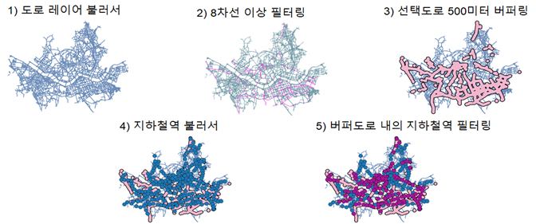
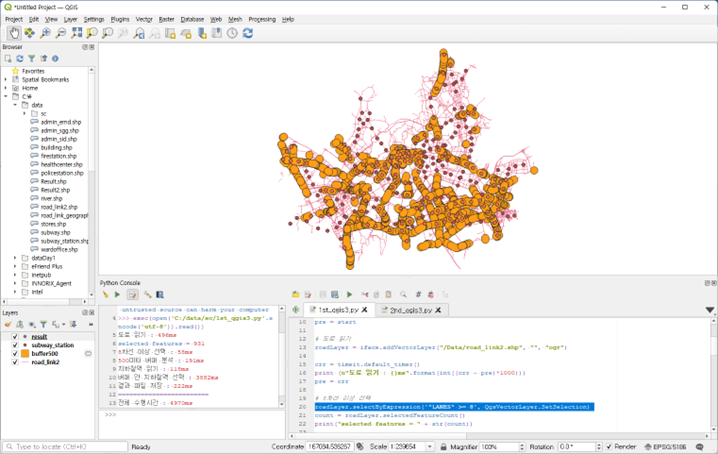
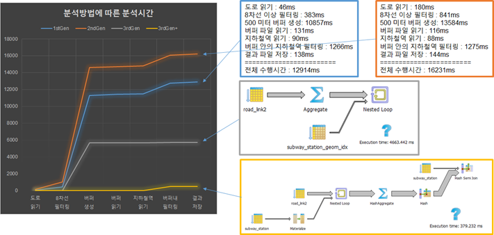

# CLI 공간데이터 처리 (QGSIS Python Console, OGR)

<br>

> 이제 공간정보를 DBMS에 넣어 효과적으로 관리하는 방법을 배워보도록 하겠습니다.

- [QGIS 파이썬 콘솔](#qgis-파이썬-콘솔)
- [공간자료를 효과적으로 다루는 커맨드라인 명령어](#공간자료를-효과적으로-다루는-커맨드라인-명령어)

<br>

## QGIS 파이썬 콘솔

이전시간에 실습해본 공간데이터를 저장할 수 있는 환경을 만들고, 공간자료를 DB에 올리는 작업이 실은 내부적으로는 공간 SQL을 통해 이루어 졌었습니다.
공간 SQL로 자료를 올렸으니, 불러올 수도 있겠지요? 불러 올 때 공간정보를 조건으로 줄 수도 있습니다.
또 QGIS 엔진들이 제공하는 공간자료 분석기능도 상당수 공간 SQL로 제공되고 있어 복잡한 분석도 가능합니다.

GIS 엔진이 파일을 직접 읽는 형태를 1세대, 용량 등의 한계를 극복하기 위해 여기에 RDBMS가 붙어 속성자료를 처리하는 형태가 2세대, 공간 RDBMS를 이용하는 것이 3세대로 설명되고 있습니다.

   
출처: http://workshops.boundlessgeo.com/postgis-intro/introduction.html

<br>

간단한 작업을 예로 실제 공간 SQL이 어떻게 동작하고 어떤 장점이 있는지 확인해 보겠습니다.
이전시간에 PostGIS에 올려둔 자료를 가지고, 서울시내 8차선 이상 도로에서 500미터 이내 거리의 지하철역을 찾는 SQL을 여러가지 형태로 만들어 보겠습니다.

전통적인 GIS 툴에서는 아래 그림과 같은 5단계로 이 작업을 수행합니다.



<br>

이 과정을 5가지 방식으로 공간 Python과 SQL로 만들어 보았습니다.
- 1세대 방식 : 파일기반으로 GIS 툴을 이용해 분석
- 2세대 방식 : DB에서 데이터 불러와 GIS 툴을 이용해 분석
- 3세대 방식 : 기존 분석과정 그대로 SQL로 분석
- 3세대 방식 개선 : DB에서 효율적으로 동작 가능한 SQL로 분석
- 3세대 방식 더 개선 : 더 효율적인 함수로 변경

<br><br>

### 1세대 방식 : 파일기반으로 GIS 툴을 이용해 분석

<br>

QGIS에서 이 과정을 수행할 수 있는 스크립트를 만들면 다음과 같습니다.

```python
#-*- coding: utf-8 -*- QGIS3

# 캔버스 초기화
QgsProject.instance().removeAllMapLayers()
iface.mapCanvas().refresh()

# 타이머 준비
import timeit
start = timeit.default_timer()
pre = start

# 도로 읽기
roadLayer = iface.addVectorLayer("/Data/road_link2.shp", "", "ogr")

crr = timeit.default_timer()
print (u"도로 읽기 : {}ms".format(int((crr - pre)*1000)))
pre = crr

# 8차선 이상 선택
roadLayer.selectByExpression('"LANES" >= 8', QgsVectorLayer.SetSelection)
count = roadLayer.selectedFeatureCount()
print("selected features = " + str(count))

crr = timeit.default_timer()
print (u"8차선 이상 선택 : {}ms".format(int((crr - pre)*1000)))
pre = crr

# 500미터 버퍼 분석
bufferLayer = QgsVectorLayer("Polygon?crs=epsg:5186&index=yes", "buffer500", "memory")
provider = bufferLayer.dataProvider()
bufferLayer.startEditing()
bufferFeature = QgsFeature(provider.fields())

features = roadLayer.selectedFeatures()
for feature in features:
    bufferFeature.setGeometry(feature.geometry().buffer(500, 8))
    provider.addFeatures([bufferFeature])

bufferLayer.commitChanges()
QgsProject.instance().addMapLayer(bufferLayer)
iface.mapCanvas().refresh()

crr = timeit.default_timer()
print (u"500미터 버퍼 분석 : {}ms".format(int((crr - pre)*1000)))
pre = crr

# 지하철역 읽기
stationLayer = iface.addVectorLayer("/Data/subway_station.shp", "", "ogr")

crr = timeit.default_timer()
print (u"지하철역 읽기 : {}ms".format(int((crr - pre)*1000)))
pre = crr

# 버퍼 안 지하철역 선택
for iFeature in bufferLayer.getFeatures():
    for sfeature in stationLayer.getFeatures():
        if sfeature.geometry().within(iFeature.geometry()):
            stationLayer.select(sfeature.id())

crr = timeit.default_timer()
print (u"버퍼 안 지하철역 선택 : {}ms".format(int((crr - pre)*1000)))
pre = crr

# 결과 파일 저장
QgsVectorFileWriter.writeAsVectorFormat( stationLayer, "/Data/Result.shp", "cp949", stationLayer.crs(), "ESRI Shapefile", 1)
iface.addVectorLayer("/Data/Result.shp", "result", "ogr")

crr = timeit.default_timer()
print (u"결과 파일 저장 : {}ms".format(int((crr - pre)*1000)))

print (u"========================")
print (u"전체 수행시간 : {}ms".format(int((crr - start)*1000)))

```



<br><br>

### 2세대 방식 : DB에서 데이터 불러와 GIS 툴을 이용해 분석

<br>
1세대 방식을 데이터 소스만 바꿔 DB에서 실행하도록 한 것입니다.
DB 접속정보를 설정하고 이를 이용해 자료를 불러오는 방식에 집중해 보시면 좋습니다.

이 샘플데이너는 너무 크기가 작아 2세대 방식의 장점을 살릴 수는 없습니다.

```py
#-*- coding: utf-8 -*- QGIS3

# 캔버스 초기화
QgsProject.instance().removeAllMapLayers()
iface.mapCanvas().refresh()

# 타이머 준비
import timeit
start = timeit.default_timer()
pre = start

# 도로(DB) 읽기
uri = QgsDataSourceUri()
uri.setConnection("localhost", "5432", "osgeo", "postgres", "postgres")
uri.setDataSource("public", "road_link2", "geom")
roadLayer = iface.addVectorLayer(uri.uri(False), "road(DB)", "postgres")

crr = timeit.default_timer()
print (u"도로(DB) 읽기 : {}ms".format(int((crr - pre)*1000)))
pre = crr

# 8차선 이상 선택
roadLayer.selectByExpression('"LANES" >= 8', QgsVectorLayer.SetSelection)
count = roadLayer.selectedFeatureCount()
print("selected features = " + str(count))

crr = timeit.default_timer()
print (u"8차선 이상 선택 : {}ms".format(int((crr - pre)*1000)))
pre = crr

# 500미터 버퍼 분석
bufferLayer = QgsVectorLayer("Polygon?crs=epsg:5186&index=yes", "buffer500", "memory")
provider = bufferLayer.dataProvider()
bufferLayer.startEditing()
bufferFeature = QgsFeature(provider.fields())

features = roadLayer.selectedFeatures()
for feature in features:
    bufferFeature.setGeometry(feature.geometry().buffer(500, 8))
    provider.addFeatures([bufferFeature])

bufferLayer.commitChanges()
QgsProject.instance().addMapLayer(bufferLayer)
iface.mapCanvas().refresh()

crr = timeit.default_timer()
print (u"500미터 버퍼 분석 : {}ms".format(int((crr - pre)*1000)))
pre = crr

# 지하철역(DB) 읽기
uri.setDataSource("public", "subway_station", "geom")
stationLayer = iface.addVectorLayer(uri.uri(False), "subway_station(DB)", "postgres")

crr = timeit.default_timer()
print (u"지하철역(DB) 읽기 : {}ms".format(int((crr - pre)*1000)))
pre = crr

# 버퍼 안 지하철역 선택
for iFeature in bufferLayer.getFeatures():
    for sfeature in stationLayer.getFeatures():
        if sfeature.geometry().within(iFeature.geometry()):
            stationLayer.select(sfeature.id())

crr = timeit.default_timer()
print (u"버퍼 안 지하철역 선택 : {}ms".format(int((crr - pre)*1000)))
pre = crr

# 결과 파일 저장
QgsVectorFileWriter.writeAsVectorFormat( stationLayer, "/Data/Result2.shp", "cp949", stationLayer.crs(), "ESRI Shapefile", 1)
iface.addVectorLayer("/Data/Result2.shp", "result2", "ogr")

crr = timeit.default_timer()
print (u"결과 파일 저장 : {}ms".format(int((crr - pre)*1000)))

print (u"========================")
print (u"전체 수행시간 : {}ms".format(int((crr - start)*1000)))

```

<br><br>

### 3세대 방식 : 기존 분석과정 그대로 SQL로 분석

<br>

이제 앞에서 해본 전통적인 GIS 작업을 그대로 SQL로 바꾼 것입니다.
얼마나 짧아졌는지에 집중해 봐 주세요.

```sql
select st.*
from subway_station as st,
(
    select st_buffer(st_union(geom), 500) as geom
    from road_link2 where lanes >=8
) as buf
where st_within(st.geom, buf.geom)
```

도로중심선 레이어에서 8차선 이상만 필터링 해, st_buffer 함수로 버퍼링하고, 그 결과를 지하철역 레이어와 st_within 함수를 조건으로 JOIN 하는 것으로 끝입니다.

<br><br>

### 3세대 방식 개선 : DB에서 효율적으로 동작 가능한 SQL로 분석

<br>

앞의 공간 SQL을 좀더 RDBMS의 장점을 살리도록 바꿀 수도 있습니다.

```sql
select * from subway_station
where gid in
(
    select distinct st.gid
    from subway_station as st, road_link2 as road
    where road.lanes >= 8
        and ST_Distance(st.geom, road.geom) <= 500
)
```
<br>

핵심은 시간이 많이 소요되는 버퍼링 과정 대신 st_distance 함수를 써서 거리 계산으로 바꿔버렸다는 것입니다. 이렇게 DBMS에서는 공간연산 보다는 숫자계산이 월씬 빠릅니다.

주의할 것은 이렇게 JOIN을 이용하는 경우 동일한 데이터가 여러번 나오는 경우가 있습니다. 이를 피하기 위해 위 소스의 앞 2줄처럼 필요한 공간객체의 id 값만을 서브쿼리 내에서 조회한 것을 다시 원하는 레이어의 where 절 조건으로 주는 것이 좋습니다.

<br><br>

### 3세대 방식 더 개선 : 더 효율적인 함수로 변경

<br>

조금 더 고민하면 이를 더 빨리 할 수도 있습니다.

```sql
select * from subway_station
where gid in
(
    select distinct st.gid
    from subway_station as st, road_link2 as road
    where road.lanes >= 8
        and ST_DWithin(st.geom, road.geom, 500)
)
```

<br>

비슷해 보이지만 st_distance 대신 st_dwithin을 사용해 거리기준 필터링을 했다는 점에서 차이가 있습니다.
st_distance를 사용한 방식에서는 모든 지하철역과 모든 도로간 거리를 다 계산해 500미터 이내만 필터링 했습니다.

하지만, st_dwithin을 사용한 방식은 내부적으로 먼저 최소영역사각형(MBR, Minimum Bounded Rectangle)으로 판단해 500미터 이내에 들어올 가능성이 없는 것은 아예 거리계산도 안하고 걸러내고 가는성이 있는 것들만 거리계산을 한다는 차이가 있습니다.

앞에서 살펴본 방식들의 성능을 비교해 본 그림입니다.
노란색의 4번째 방식이 어마어마하게 빠르지요? 그림에는 없는 5번째 방식은 4번째 방식보다 10배 정도 빠릅니다.



<br><br>

## 공간자료를 효과적으로 다루는 커맨드라인 명령어

<br>


<br><br>

The End

<br>

[> 처음으로](README.md)