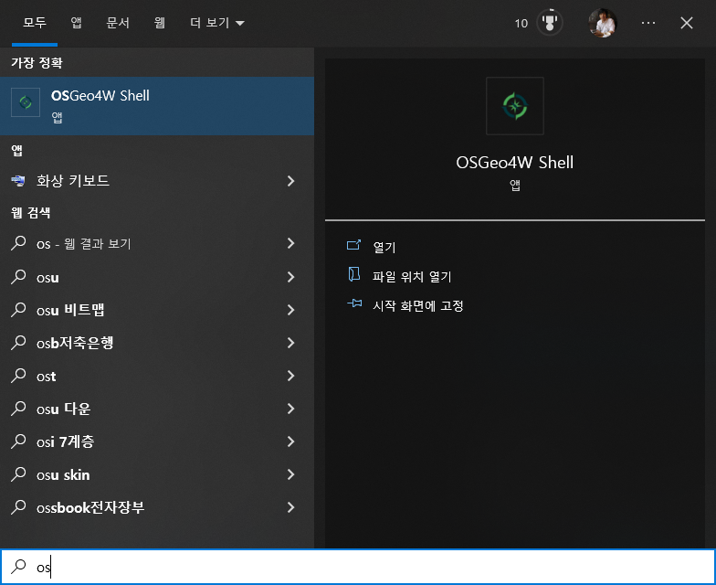
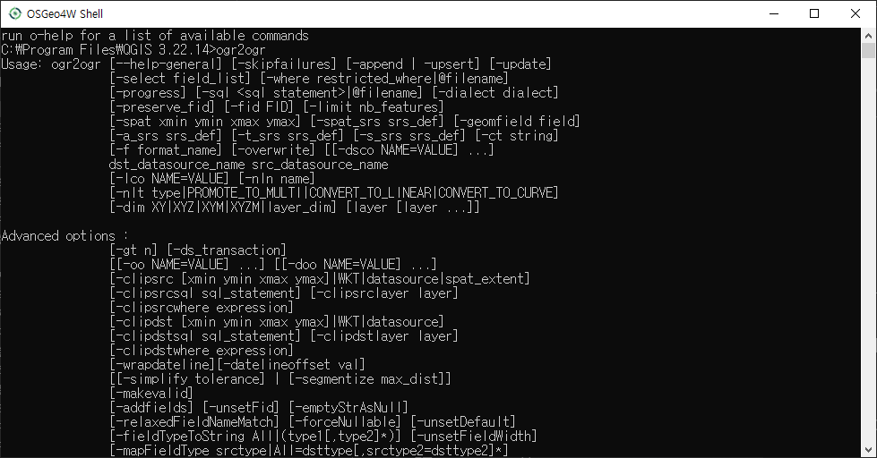
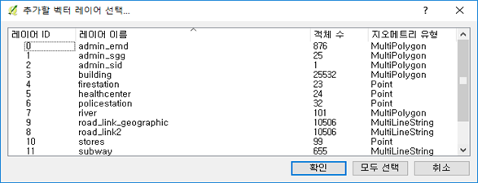

# CLI 공간데이터 처리 (QGSIS Python Console, OGR)

<br>

> 이제 공간정보를 DBMS에 넣어 효과적으로 관리하는 방법을 배워보도록 하겠습니다.

- [QGIS 파이썬 콘솔](#qgis-파이썬-콘솔)
- [공간자료를 효과적으로 다루는 커맨드라인 명령어](#공간자료를-효과적으로-다루는-커맨드라인-명령어)

<br>

## QGIS 파이썬 콘솔

이전시간에 실습해본 공간데이터를 저장할 수 있는 환경을 만들고, 공간자료를 DB에 올리는 작업이 실은 내부적으로는 공간 SQL을 통해 이루어 졌었습니다.
공간 SQL로 자료를 올렸으니, 불러올 수도 있겠지요? 불러 올 때 공간정보를 조건으로 줄 수도 있습니다.
또 QGIS 엔진들이 제공하는 공간자료 분석기능도 상당수 공간 SQL로 제공되고 있어 복잡한 분석도 가능합니다.

GIS 엔진이 파일을 직접 읽는 형태를 1세대, 용량 등의 한계를 극복하기 위해 여기에 RDBMS가 붙어 속성자료를 처리하는 형태가 2세대, 공간 RDBMS를 이용하는 것이 3세대로 설명되고 있습니다.

   
출처: http://workshops.boundlessgeo.com/postgis-intro/introduction.html

<br>

간단한 작업을 예로 실제 공간 SQL이 어떻게 동작하고 어떤 장점이 있는지 확인해 보겠습니다.
이전시간에 PostGIS에 올려둔 자료를 가지고, 서울시내 8차선 이상 도로에서 500미터 이내 거리의 지하철역을 찾는 SQL을 여러가지 형태로 만들어 보겠습니다.

전통적인 GIS 툴에서는 아래 그림과 같은 5단계로 이 작업을 수행합니다.


<br>

이 과정을 5가지 방식으로 공간 Python과 SQL로 만들어 보았습니다.
- 1세대 방식 : 파일기반으로 GIS 툴을 이용해 분석
- 2세대 방식 : DB에서 데이터 불러와 GIS 툴을 이용해 분석
- 3세대 방식 : 기존 분석과정 그대로 SQL로 분석
- 3세대 방식 개선 : DB에서 효율적으로 동작 가능한 SQL로 분석
- 3세대 방식 더 개선 : 더 효율적인 함수로 변경

<br><br>

### 1세대 방식 : 파일기반으로 GIS 툴을 이용해 분석

<br>

QGIS에서 이 과정을 수행할 수 있는 스크립트를 만들면 다음과 같습니다.

```python
#-*- coding: utf-8 -*- QGIS3

# 캔버스 초기화
QgsProject.instance().removeAllMapLayers()
iface.mapCanvas().refresh()

# 타이머 준비
import timeit
start = timeit.default_timer()
pre = start

# 도로 읽기
roadLayer = iface.addVectorLayer("/Data/road_link2.shp", "", "ogr")

crr = timeit.default_timer()
print (u"도로 읽기 : {}ms".format(int((crr - pre)*1000)))
pre = crr

# 8차선 이상 선택
roadLayer.selectByExpression('"LANES" >= 8', QgsVectorLayer.SetSelection)
count = roadLayer.selectedFeatureCount()
print("selected features = " + str(count))

crr = timeit.default_timer()
print (u"8차선 이상 선택 : {}ms".format(int((crr - pre)*1000)))
pre = crr

# 500미터 버퍼 분석
bufferLayer = QgsVectorLayer("Polygon?crs=epsg:5186&index=yes", "buffer500", "memory")
provider = bufferLayer.dataProvider()
bufferLayer.startEditing()
bufferFeature = QgsFeature(provider.fields())

features = roadLayer.selectedFeatures()
for feature in features:
    bufferFeature.setGeometry(feature.geometry().buffer(500, 8))
    provider.addFeatures([bufferFeature])

bufferLayer.commitChanges()
QgsProject.instance().addMapLayer(bufferLayer)
iface.mapCanvas().refresh()

crr = timeit.default_timer()
print (u"500미터 버퍼 분석 : {}ms".format(int((crr - pre)*1000)))
pre = crr

# 지하철역 읽기
stationLayer = iface.addVectorLayer("/Data/subway_station.shp", "", "ogr")

crr = timeit.default_timer()
print (u"지하철역 읽기 : {}ms".format(int((crr - pre)*1000)))
pre = crr

# 버퍼 안 지하철역 선택
for iFeature in bufferLayer.getFeatures():
    for sfeature in stationLayer.getFeatures():
        if sfeature.geometry().within(iFeature.geometry()):
            stationLayer.select(sfeature.id())

crr = timeit.default_timer()
print (u"버퍼 안 지하철역 선택 : {}ms".format(int((crr - pre)*1000)))
pre = crr

# 결과 파일 저장
QgsVectorFileWriter.writeAsVectorFormat( stationLayer, "/Data/Result.shp", "cp949", stationLayer.crs(), "ESRI Shapefile", 1)
iface.addVectorLayer("/Data/Result.shp", "result", "ogr")

crr = timeit.default_timer()
print (u"결과 파일 저장 : {}ms".format(int((crr - pre)*1000)))

print (u"========================")
print (u"전체 수행시간 : {}ms".format(int((crr - start)*1000)))

```


<br><br>

### 2세대 방식 : DB에서 데이터 불러와 GIS 툴을 이용해 분석

<br>
1세대 방식을 데이터 소스만 바꿔 DB에서 실행하도록 한 것입니다.
DB 접속정보를 설정하고 이를 이용해 자료를 불러오는 방식에 집중해 보시면 좋습니다.

이 샘플데이너는 너무 크기가 작아 2세대 방식의 장점을 살릴 수는 없습니다.

```py
#-*- coding: utf-8 -*- QGIS3

# 캔버스 초기화
QgsProject.instance().removeAllMapLayers()
iface.mapCanvas().refresh()

# 타이머 준비
import timeit
start = timeit.default_timer()
pre = start

# 도로(DB) 읽기
uri = QgsDataSourceUri()
uri.setConnection("localhost", "5432", "osgeo", "postgres", "postgres")
uri.setDataSource("public", "road_link2", "geom")
roadLayer = iface.addVectorLayer(uri.uri(False), "road(DB)", "postgres")

crr = timeit.default_timer()
print (u"도로(DB) 읽기 : {}ms".format(int((crr - pre)*1000)))
pre = crr

# 8차선 이상 선택
roadLayer.selectByExpression('"LANES" >= 8', QgsVectorLayer.SetSelection)
count = roadLayer.selectedFeatureCount()
print("selected features = " + str(count))

crr = timeit.default_timer()
print (u"8차선 이상 선택 : {}ms".format(int((crr - pre)*1000)))
pre = crr

# 500미터 버퍼 분석
bufferLayer = QgsVectorLayer("Polygon?crs=epsg:5186&index=yes", "buffer500", "memory")
provider = bufferLayer.dataProvider()
bufferLayer.startEditing()
bufferFeature = QgsFeature(provider.fields())

features = roadLayer.selectedFeatures()
for feature in features:
    bufferFeature.setGeometry(feature.geometry().buffer(500, 8))
    provider.addFeatures([bufferFeature])

bufferLayer.commitChanges()
QgsProject.instance().addMapLayer(bufferLayer)
iface.mapCanvas().refresh()

crr = timeit.default_timer()
print (u"500미터 버퍼 분석 : {}ms".format(int((crr - pre)*1000)))
pre = crr

# 지하철역(DB) 읽기
uri.setDataSource("public", "subway_station", "geom")
stationLayer = iface.addVectorLayer(uri.uri(False), "subway_station(DB)", "postgres")

crr = timeit.default_timer()
print (u"지하철역(DB) 읽기 : {}ms".format(int((crr - pre)*1000)))
pre = crr

# 버퍼 안 지하철역 선택
for iFeature in bufferLayer.getFeatures():
    for sfeature in stationLayer.getFeatures():
        if sfeature.geometry().within(iFeature.geometry()):
            stationLayer.select(sfeature.id())

crr = timeit.default_timer()
print (u"버퍼 안 지하철역 선택 : {}ms".format(int((crr - pre)*1000)))
pre = crr

# 결과 파일 저장
QgsVectorFileWriter.writeAsVectorFormat( stationLayer, "/Data/Result2.shp", "cp949", stationLayer.crs(), "ESRI Shapefile", 1)
iface.addVectorLayer("/Data/Result2.shp", "result2", "ogr")

crr = timeit.default_timer()
print (u"결과 파일 저장 : {}ms".format(int((crr - pre)*1000)))

print (u"========================")
print (u"전체 수행시간 : {}ms".format(int((crr - start)*1000)))

```

<br><br>

### 3세대 방식 : 기존 분석과정 그대로 SQL로 분석

<br>

이제 앞에서 해본 전통적인 GIS 작업을 그대로 SQL로 바꾼 것입니다.
얼마나 짧아졌는지에 집중해 봐 주세요.

```sql
select st.*
from subway_station as st,
(
    select st_buffer(st_union(geom), 500) as geom
    from road_link2 where lanes >=8
) as buf
where st_within(st.geom, buf.geom)
```

도로중심선 레이어에서 8차선 이상만 필터링 해, st_buffer 함수로 버퍼링하고, 그 결과를 지하철역 레이어와 st_within 함수를 조건으로 JOIN 하는 것으로 끝입니다.

<br><br>

### 3세대 방식 개선 : DB에서 효율적으로 동작 가능한 SQL로 분석

<br>

앞의 공간 SQL을 좀더 RDBMS의 장점을 살리도록 바꿀 수도 있습니다.

```sql
select * from subway_station
where gid in
(
    select distinct st.gid
    from subway_station as st, road_link2 as road
    where road.lanes >= 8
        and ST_Distance(st.geom, road.geom) <= 500
)
```
<br>

핵심은 시간이 많이 소요되는 버퍼링 과정 대신 st_distance 함수를 써서 거리 계산으로 바꿔버렸다는 것입니다. 이렇게 DBMS에서는 공간연산 보다는 숫자계산이 월씬 빠릅니다.

주의할 것은 이렇게 JOIN을 이용하는 경우 동일한 데이터가 여러번 나오는 경우가 있습니다. 이를 피하기 위해 위 소스의 앞 2줄처럼 필요한 공간객체의 id 값만을 서브쿼리 내에서 조회한 것을 다시 원하는 레이어의 where 절 조건으로 주는 것이 좋습니다.

<br><br>

### 3세대 방식 더 개선 : 더 효율적인 함수로 변경

<br>

조금 더 고민하면 이를 더 빨리 할 수도 있습니다.

```sql
select * from subway_station
where gid in
(
    select distinct st.gid
    from subway_station as st, road_link2 as road
    where road.lanes >= 8
        and ST_DWithin(st.geom, road.geom, 500)
)
```

<br>

비슷해 보이지만 st_distance 대신 st_dwithin을 사용해 거리기준 필터링을 했다는 점에서 차이가 있습니다.
st_distance를 사용한 방식에서는 모든 지하철역과 모든 도로간 거리를 다 계산해 500미터 이내만 필터링 했습니다.

하지만, st_dwithin을 사용한 방식은 내부적으로 먼저 최소영역사각형(MBR, Minimum Bounded Rectangle)으로 판단해 500미터 이내에 들어올 가능성이 없는 것은 아예 거리계산도 안하고 걸러내고 가는성이 있는 것들만 거리계산을 한다는 차이가 있습니다.

앞에서 살펴본 방식들의 성능을 비교해 본 그림입니다.
노란색의 4번째 방식이 어마어마하게 빠르지요? 그림에는 없는 5번째 방식은 4번째 방식보다 10배 정도 빠릅니다.


<br><br>

## 공간자료를 효과적으로 다루는 커맨드라인 명령어

<br>

공간자료 자체를 다루는 강의의 마지막 부분으로 커맨드라인 명령어(CLI, Command Line Interface)를 이용해 공간자료를 다루는 방법을 배워보겠습니다.

벡터 데이터를 다룰 때는 ogr 명령들이 주로 사용됩니다.
https://gdal.org/programs/index.html#vector-programs 
이 링크에 가면 여러가지 명령이 있는데 본 강의에서는 ogr2ogr만을 배웁니다.

윈도우 환경에서 공간정보 관련 명령어들을 쓰시려면 QGIS와 함께 설치된 OSGeo4W Shell을 이용하시는 것이 편합니다.
화면이나 키보드의 윈도우 버튼을 누르고 'osgeo4w'를 검색하시면 쉽게 찾으실 수 있을 것입니다.
혹시 안되시면 [시작] 버튼 누르시고 QGIS을 찾아 그 안에 보시면 OSGeo4W Shell이 있습니다.



<br>

아이콘을 눌러 시작하면 검은 도스창이 나옵니다.
여기에 `ogr2ogr` 명령을 입력해서 옵션 설명이 보이면 정상 동작하는 것입니다.



<br>

ogr2ogr로 가장 많이 하는 작업은 공간자료를 다룰 때 가장 힘든 작업인 벡터자료의 좌표계를 바꿔주는 작업입니다.
실습 자료가 들어 있는 C:\data 폴더로 이동해서 firestation 레이어를 EPSG:5174 좌표계로 변환해 보겠습니다.

```
cd C:\data
```
```
ogr2ogr -s_srs EPSG:5186 -t_srs "+proj=tmerc +lat_0=38 +lon_0=127.0028902777778 +k=1 +x_0=200000 +y_0=500000 +ellps=bessel +units=m +no_defs" -f "ESRI Shapefile" --config SHAPE_ENCODING "CP949" firestation_5174.shp firestation.shp
```

<br>

ogr2ogr의 인자를 하나씩 살펴보겠습니다.

-s_srs 인자는 원본(source) 자료의 좌표계를 의미합니다. EPSG:5186 좌표계로 지정했네요.
-t_srs 인자는 대상(target) 자료의 좌표계를 의미합니다. EPSG:5174 좌표계로 바꾼다고 했는데, 뭔가 많은 내용이 들어있네요. 이것은 ogr2ogr도 Bessel 타원체의 변환정보가 잘못되어 있기 때문입니다. 이런 경우에는 간단히 적어줄 수 없고, proj4용 좌표계 인자들을 모두 써줘야 합니다.
-f 인자는 대상자료를 어떤 포맷(format)으로 만들지를 의미합니다.
--config SHAPE_ENCODING 인자는 ESRI Shape을 다룰 때만 들어가는 추가인자로 한글 등의 코드페이지를 의미합니다.


그리고 주의할 것이 마지막 부분의 인자 순서가 다른 명령과 달리 조금 특이합니다.
대상파일 명(firestation_5174.shp)이 먼저 나오고 원본파일 명(firestation.shp)이 뒤에 나옵니다.

스크립트의 인자가 많아 생각보다 복잡했지요?
이런 좌표계 변환 작업은 QGIS에서도 쉽게 할 수 있긴 합니다. 심지어 UI가 있어 더 편합니다.
하지만, 좌표계 변환해야 하는 파일이 100개라면? 혹은 1000개라면?
많은 수의 파일을 작업해야 할 때, 혹은 아주 상세한 설정이 필요할 때 커맨드라인 명령어를 사용하면 대단히 효과적이고, 스크립트로 저장해서 실행하면 어떤 작업을 했는지 나중에도 명확히 관리할 수 있는 장점이 있습니다.

이번에는 공간자료의 파일 포맷 변환에 ogr2ogr을 사용해 보겠습니다.

```
ogr2ogr -f "GPKG" output.gpkg PG:"host=localhost dbname=osgeo user=postgres password=postgres schemas=public tables=admin_emd,admin_sgg,admin_sid,building,firestation,healthcenter,policestation,river,road_link2,road_link_geographic,stores,subway,subway_station,wardoffice"
```

-f 인자를 "GPKG"로 해서 만들어지는 파일 포맷을 GeoPackage로 지정했네요.

그리고 좌표계 등 다른 인자 없이 바로 대상파일과 소스 파일이 나오네요.
대상 파일은 output.gpkg 파일이군요. 이건 쉽습니다.
원본 파일은 파일이 아니네요! PostGIS 접속정보를 써 놨습니다.
특히 tables 항목에 여러 레이어를 지정해서 한꺼번에 받고 있네요.

만들어진 output.gpkg를 QGIS에서 열어 보시면 다음처럼 여러 레이어가 들어 있습니다.



<br>

이렇게 ogr2ogr을 다양한 공간정보간의 포맷변환에 사용하실 수 있습니다. 심지어 Oracle Spatial, ArcSDE 등의 독점 소프트웨어 DBMS의 자료도 잘 다룹니다.

심지어 DBMS가 아닌 파일에도 SQL로 원하는 자료만 뽑아 낼 수 있습니다.

```
ogr2ogr -sql "select * from road_link2 where lanes >= 8" --config SHAPE_ENCODING "CP949" lane8.shp road_link2.shp
```

-sql 옵션으로 SQL을 실행하고 있네요. 이 SQL은 PostGIS의 SQL과는 약간 다르고 공간 SQL은 안됩니다. 

--config SHAPE_ENCODING 옵션은 CP949 인코딩의 한글이 들어있는 Shape 파일을 다룰 때는 꼭 필요합니다. 없으면 오류가 납니다.

대상파일과 원본파일은 형식을 지정하지 않았는데도 문제 없네요.
파일의 확장자나 파일 내용을 보고 OGR이 알아서 판단합니다. 
하지만, 알아서 판단하는 것이 틀리는 경우가 있기에 가능하다면 명확히 지정해 주는 것이 좋습니다.
경고들이 주욱 나오기는 하는데요, 이는 자리수의 문제 때문이고 오류는 아닙니다.

<br>

이제 래스터 자료를 다뤄 보겠습니다.
래스터 자료용 명령어는 GDAL이 담당하고 있습니다.
https://gdal.org/programs/index.html#raster-programs 

GDAL 명령어는 목적에 따라 여러가지를 사용합니다.
먼저 래스터 데이터의 정보를 조회해 보겠습니다. 

```
gdalinfo BlueMarbleNG-TB_2004-12-01_rgb_3600x1800.TIFF
```

여러가지 정보를 확인할 수 있는데, 영상의 크기가 3600, 1800 로 나옵니다.
Coordinate System 부분에서 좌표계도 알 수 있습니다. ESPG:4326이니 경위도군요.
Pixel Size = (0.100000000000000,-0.100000000000000)를 보니 한 픽셀이 0.1 단위고 경위도니 0.1도 해상도 자료입니다. Y 방향에는 보통 마이너스 기호가 붙어 있습니다.
공간적 범위는 Corner Coordinates 부분을 보면 됩니다. 전지구 범위의 영상이네요.

<br>

이제 포맷 변환을 해보겠습니다.

```
gdal_translate -of JPEG BlueMarbleNG-TB_2004-12-01_rgb_3600x1800.TIFF WorldMap.jpg
```

-of 인자가 대상파일의 포맷을 지정하고 있습니다.

원본과 대상 파일을 지정하는 순서가 ogr2ogr과는 달리 상식적으로 원본, 대상 순임도 주의하세요.

10 메가 바이트 GeoTIFF 파일을 600 킬로 바이트 JPEG 파일로 변환했습니다.
변환된 JPEG 파일과 함께 공간정보를 담고 있는 WorldMap.jpg.aux.xml 파일도 같이 생겨서 QGIS 등의 프로그램에서 여전히 공간정보로 사용할 수 있네요.

<br>

래스터 데이터의 좌표계 변환도 많이 하는 작업입니다.

```
gdalwarp -s_srs EPSG:4326 -t_srs EPSG:5179 -of GTiff -r cubic -te 123 32 132 44 -te_srs EPSG:4326 BlueMarbleNG-TB_2004-12-01_rgb_3600x1800.TIFF Korea_5179.tif
```

-s_srs 인자는 원본 좌표계이고 경위도좌표계네요.
-t_srs 인자는 대상 좌표계이고 국가인터넷지도와 네이버지도에서 사용중인 GRS80타원체 UTM-K네요.
-of 인자는 대상파일 포맷임을 다 아시겠지요?
-r 인자는 대상영상의 각 픽셀값을 결정할때 원본에 있는 점들 여러개를 어찌 보간할지인데, 2차방정식을 선택했네요.
-te 인자는 대상파일을 만들 공간영역입니다. minX minY maxX maxY 순서로 적습니다.
-te_srs 인자는 -te 인자에 쓰인 좌표계가 무엇인지 설정하는 것이네요. 경위도로 했군요.
뒤에는 역시 원본파일 대상파일 순으로 적었습니다.

<br>

래스터 데이터를 빨리 보이게 하는 대표적인 방법이 미리보기(Overlay) 영상을 피라미드 처럼 다단계로 만들어 두는 것입니다.

```
gdaladdo -r average BlueMarbleNG-TB_2004-12-01_rgb_3600x1800.TIFF 2 4 8 16 32
```

-r 인자로 보간방법을 지정했는데 이번에는 평균법으로 했습니다.
그리고 오버레이를 만들 파일이름이 나오고 몇 개씩의 픽셀을 합쳐 오버레이를 만들지 숫자들이 나오네요.

이렇게 오버레이를 만들어 두면 QGIS나 GeoServer 등에서 큰 영상을 매우 빠른 속도로 볼 수 있습니다.
오버레이가 만들어진 영상은 QGIS의 속성창에서 피라미드 탭의 해상도 부분을 보면 확인할 수 있습니다.
오버레이가 만들어지지 않은 단계가 있는 경우 이 부분이 붉은색 아이콘으로 표시됩니다.

<br><br>

The End

<br>

[> 처음으로](README.md)