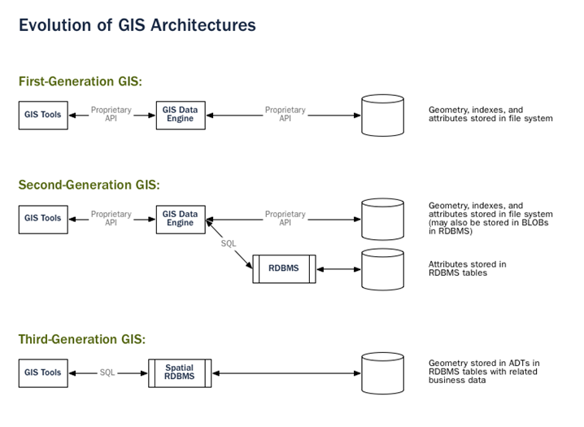

# CLI 공간데이터 처리 (QGSIS Python Console, OGR)

<br>

> 이제 공간정보를 DBMS에 넣어 효과적으로 관리하는 방법을 배워보도록 하겠습니다.

- [QGIS 파이썬 콘솔](#qgis-파이썬-콘솔)
- [공간자료를 효과적으로 다루는 커맨드라인 명령어](#공간자료를-효과적으로-다루는-커맨드라인-명령어)

<br>

## QGIS 파이썬 콘솔

이전시간에 실습해본 공간데이터를 저장할 수 있는 환경을 만들고, 공간자료를 DB에 올리는 작업이 실은 내부적으로는 공간 SQL을 통해 이루어 졌었습니다.
공간 SQL로 자료를 올렸으니, 불러올 수도 있겠지요? 불러 올 때 공간정보를 조건으로 줄 수도 있습니다.
또 QGIS 엔진들이 제공하는 공간자료 분석기능도 상당수 공간 SQL로 제공되고 있어 복잡한 분석도 가능합니다.

GIS 엔진이 파일을 직접 읽는 형태를 1세대, 용량 등의 한계를 극복하기 위해 여기에 RDBMS가 붙어 속성자료를 처리하는 형태가 2세대, 공간 RDBMS를 이용하는 것이 3세대로 설명되고 있습니다.

   
출처: http://workshops.boundlessgeo.com/postgis-intro/introduction.html

<br>

간단한 작업을 예로 실제 공간 SQL이 어떻게 동작하고 어떤 장점이 있는지 확인해 보겠습니다.
이전시간에 PostGIS에 올려둔 자료를 가지고, 서울시내 8차선 이상 도로에서 500미터 이내 거리의 지하철역을 찾는 SQL을 여러가지 형태로 만들어 보겠습니다.

전통적인 GIS 툴에서는 아래 그림과 같은 5단계로 이 작업을 수행합니다.


<br>

이 과정을 5가지 방식으로 공간 Python과 SQL로 만들어 보았습니다.
- 1세대 방식 : 파일기반으로 GIS 툴을 이용해 분석
- 2세대 방식 : DB에서 데이터 불러와 GIS 툴을 이용해 분석
- 3세대 방식 : 기존 분석과정 그대로 SQL로 분석
- 3세대 방식 개선 : DB에서 효율적으로 동작 가능한 SQL로 분석
- 3세대 방식 더 개선 : 더 효율적인 함수로 변경

<br><br>

### 1세대 방식 : 파일기반으로 GIS 툴을 이용해 분석

<br>

QGIS에서 이 과정을 수행할 수 있는 스크립트를 만들면 다음과 같습니다.

```python
#-*- coding: utf-8 -*- QGIS3

# 캔버스 초기화
QgsProject.instance().removeAllMapLayers()
iface.mapCanvas().refresh()

# 타이머 준비
import timeit
start = timeit.default_timer()
pre = start

# 도로 읽기
roadLayer = iface.addVectorLayer("/Data/road_link2.shp", "", "ogr")

crr = timeit.default_timer()
print (u"도로 읽기 : {}ms".format(int((crr - pre)*1000)))
pre = crr

# 8차선 이상 선택
roadLayer.selectByExpression('"LANES" >= 8', QgsVectorLayer.SetSelection)
count = roadLayer.selectedFeatureCount()
print("selected features = " + str(count))

crr = timeit.default_timer()
print (u"8차선 이상 선택 : {}ms".format(int((crr - pre)*1000)))
pre = crr

# 500미터 버퍼 분석
bufferLayer = QgsVectorLayer("Polygon?crs=epsg:5186&index=yes", "buffer500", "memory")
provider = bufferLayer.dataProvider()
bufferLayer.startEditing()
bufferFeature = QgsFeature(provider.fields())

features = roadLayer.selectedFeatures()
for feature in features:
    bufferFeature.setGeometry(feature.geometry().buffer(500, 8))
    provider.addFeatures([bufferFeature])

bufferLayer.commitChanges()
QgsProject.instance().addMapLayer(bufferLayer)
iface.mapCanvas().refresh()

crr = timeit.default_timer()
print (u"500미터 버퍼 분석 : {}ms".format(int((crr - pre)*1000)))
pre = crr

# 지하철역 읽기
stationLayer = iface.addVectorLayer("/Data/subway_station.shp", "", "ogr")

crr = timeit.default_timer()
print (u"지하철역 읽기 : {}ms".format(int((crr - pre)*1000)))
pre = crr

# 버퍼 안 지하철역 선택
for iFeature in bufferLayer.getFeatures():
    for sfeature in stationLayer.getFeatures():
        if sfeature.geometry().within(iFeature.geometry()):
            stationLayer.select(sfeature.id())

crr = timeit.default_timer()
print (u"버퍼 안 지하철역 선택 : {}ms".format(int((crr - pre)*1000)))
pre = crr

# 결과 파일 저장
QgsVectorFileWriter.writeAsVectorFormat( stationLayer, "/Data/Result.shp", "cp949", stationLayer.crs(), "ESRI Shapefile", 1)
iface.addVectorLayer("/Data/Result.shp", "result", "ogr")

crr = timeit.default_timer()
print (u"결과 파일 저장 : {}ms".format(int((crr - pre)*1000)))

print (u"========================")
print (u"전체 수행시간 : {}ms".format(int((crr - start)*1000)))

```


<br><br>

### 2세대 방식 : DB에서 데이터 불러와 GIS 툴을 이용해 분석

<br>
1세대 방식을 데이터 소스만 바꿔 DB에서 실행하도록 한 것입니다.
DB 접속정보를 설정하고 이를 이용해 자료를 불러오는 방식에 집중해 보시면 좋습니다.

이 샘플데이너는 너무 크기가 작아 2세대 방식의 장점을 살릴 수는 없습니다.

```py
#-*- coding: utf-8 -*- QGIS3

# 캔버스 초기화
QgsProject.instance().removeAllMapLayers()
iface.mapCanvas().refresh()

# 타이머 준비
import timeit
start = timeit.default_timer()
pre = start

# 도로(DB) 읽기
uri = QgsDataSourceUri()
uri.setConnection("localhost", "5432", "osgeo", "postgres", "postgres")
uri.setDataSource("public", "road_link2", "geom")
roadLayer = iface.addVectorLayer(uri.uri(False), "road(DB)", "postgres")

crr = timeit.default_timer()
print (u"도로(DB) 읽기 : {}ms".format(int((crr - pre)*1000)))
pre = crr

# 8차선 이상 선택
roadLayer.selectByExpression('"LANES" >= 8', QgsVectorLayer.SetSelection)
count = roadLayer.selectedFeatureCount()
print("selected features = " + str(count))

crr = timeit.default_timer()
print (u"8차선 이상 선택 : {}ms".format(int((crr - pre)*1000)))
pre = crr

# 500미터 버퍼 분석
bufferLayer = QgsVectorLayer("Polygon?crs=epsg:5186&index=yes", "buffer500", "memory")
provider = bufferLayer.dataProvider()
bufferLayer.startEditing()
bufferFeature = QgsFeature(provider.fields())

features = roadLayer.selectedFeatures()
for feature in features:
    bufferFeature.setGeometry(feature.geometry().buffer(500, 8))
    provider.addFeatures([bufferFeature])

bufferLayer.commitChanges()
QgsProject.instance().addMapLayer(bufferLayer)
iface.mapCanvas().refresh()

crr = timeit.default_timer()
print (u"500미터 버퍼 분석 : {}ms".format(int((crr - pre)*1000)))
pre = crr

# 지하철역(DB) 읽기
uri.setDataSource("public", "subway_station", "geom")
stationLayer = iface.addVectorLayer(uri.uri(False), "subway_station(DB)", "postgres")

crr = timeit.default_timer()
print (u"지하철역(DB) 읽기 : {}ms".format(int((crr - pre)*1000)))
pre = crr

# 버퍼 안 지하철역 선택
for iFeature in bufferLayer.getFeatures():
    for sfeature in stationLayer.getFeatures():
        if sfeature.geometry().within(iFeature.geometry()):
            stationLayer.select(sfeature.id())

crr = timeit.default_timer()
print (u"버퍼 안 지하철역 선택 : {}ms".format(int((crr - pre)*1000)))
pre = crr

# 결과 파일 저장
QgsVectorFileWriter.writeAsVectorFormat( stationLayer, "/Data/Result2.shp", "cp949", stationLayer.crs(), "ESRI Shapefile", 1)
iface.addVectorLayer("/Data/Result2.shp", "result2", "ogr")

crr = timeit.default_timer()
print (u"결과 파일 저장 : {}ms".format(int((crr - pre)*1000)))

print (u"========================")
print (u"전체 수행시간 : {}ms".format(int((crr - start)*1000)))

```


<br>

## 공간자료를 효과적으로 다루는 커맨드라인 명령어


<br>

The End

<br>

[> 처음으로](README.md)