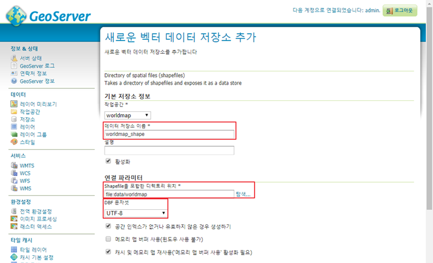
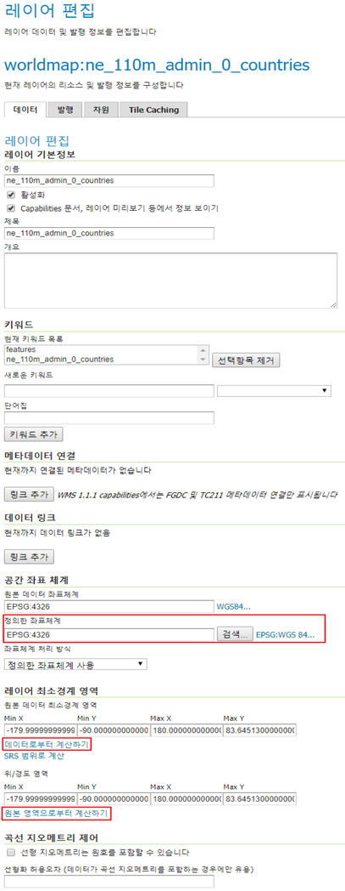
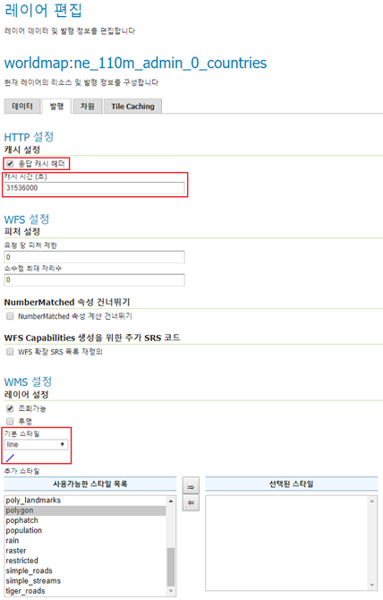
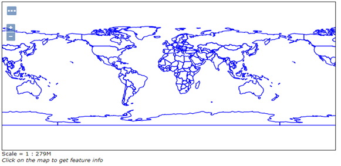
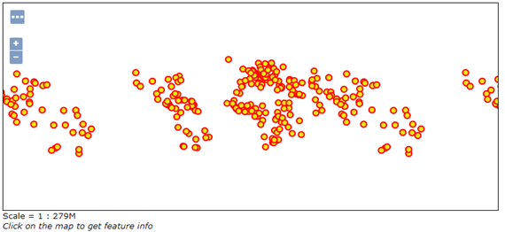
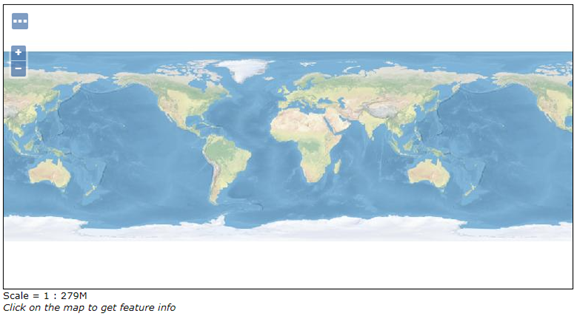
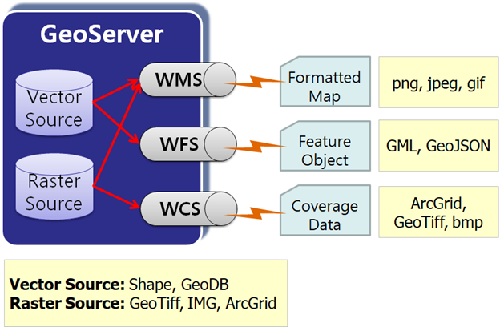
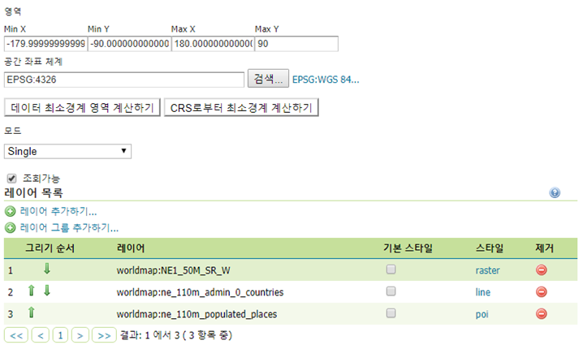

# 공간데이터 배포 (GeoServer)

> 인터넷에 공간정보를 서비스하는 GeoServer에 대해 배워보겠습니다.

 

## GeoServer 에 레이어 등록

우선 무작정 데이터를 등록해 봅시다. [GeoServer](http://geoserver.org)가 없다면 설치하세요.

GeoServer를 실행해 주세요. [시작] 버튼을 누르시고, GeoServer 안의 Start GeoServer를 선택하시면 시작됩니다. 혹시 서비스로 설치하신 분은 자동으로 시작되어 있을 것입니다.

웹브라우저를 띄우시고 다음 주소로 갑니다. http://localhost:8080/geoserver

로그인 해 주세요. 설치 시 바꾸지 않으셨다면 `username: admin, password: geoserver` 입니다.

`Layer Preview` 메뉴에 들어가보면 미리 등록된 여러 레이어들을 볼 수 있습니다. 이 레이어들은 인터넷 상에 공간정보를 서비스할 준비가 되어 있는 것입니다.

GeoServer가 깔린 폴더에 있는 `data_dir` 폴더 아래의 `data` 폴더에 `worldmap` 이란 폴더를 만들어 주세요. 압축된 파일에서 다음 3개 레이어를 이 worldmap 폴더에 복사해 주세요. ESRI Shape 파일의 경우 이름이 같은 파일들을 모두 복사해야 함을 잊지 마세요.

- NE1_50M_SR_W.tif   
- ne_110m_admin_0_countries.shp   
- ne_110m_populated_places.shp

이제 GeoServer에서 이 레이어들을 등록해 보겠습니다. GeoServer에 레이어를 등록하는 과정은 일반적으로 다음과 같은 과정을 거칩니다.

1. 작업공간 만들기
2. 저장소 만들기
3. 레이어 만들기

'작업공간'은 보통 프로젝트가 새로 시작될 때 한번씩만 만들어 주면 됩니다.

웹브라우저에 띄워놓은 GeoServer 관리화면에서 '데이터-작업공간' 메뉴를 선택합니다. '새로운 작업공간 추가하기' 버튼을 누릅니다.

Name에 worldmap, 네임스페이스 URI에 `http://myservice.com` 을 입력하고, 기본 작업공간으로 설정하기에 체크 후 '저장'을 누릅니다.

네임스페이스 URI에 지금은 아무 웹주소나 넣은 것이지만, 원래 공간정보를 서비스 하는 웹사이트 주소를 넣어주어야 합니다. 이 정보는 메타데이터로 사용자에게 전달됩니다.

이제 저장소을 만들겠습니다.

관리화면에서 '저장소' 메뉴를 선택하고, [새로운 저장소 생성하기] 버튼을 누릅니다.
 
먼저 `Directory of spatial files (shapefiles)`를 선택해 ESRI Shape 파일이 있는 폴더를 저장소로 만들어 봅시다.
 
데이터 저장소 이름에 'worldmap_shape' 입력 후, Shapefile을 포함한 디렉토리 위치의 '탐색' 버튼 눌러 'data/worldmap' 폴더 선택하고, DBF 문자셋으로 `UTF-8`을 선택하고 '저장'을 누릅니다. 만일 `cp949`로 된 한글이 있는 경우 문자셋에 `x-windows-949`를 선택하시면 됩니다.   

자동으로 '새로운 레이어' 화면으로 전환되네요. '발행하기' 링크를 눌러 `ne_110m_admin_0_countries` 레이어 부터 만들어 봅시다. 여기서 '발행하기'란 것은 영어로는 publish로 서버 안의 자료를 인터넷으로 내보낸다는 의미를 가지고 있습니다.

'발행하기' 링크를 누르면 옵션이 매우 많은 '새로운 레이어' 화면으로 넘어갑니다.

여기서 꼭 3가지 값을 확인해야 합니다.
1. 정의한 좌표체계
    - 데이터의 좌표계를 지정하는 부분입니다.
    - 자동으로 지정되는 경우도 있지만 안 그런 경우도 많습니다.
    - 실제 자료의 좌표계와 일치하게 지정해야 합니다.
2. 원본 데이터 최소경계 영역
    - 보통 최초에는 비어 있습니다.
    - '데이터로부터 계산하기' 링크를 누르면 자동으로 값이 지정됩니다.
3. 위/경도 영역
    - 정의한 좌표체계의 원본 데이터 최소경계 영역을 경위도로 바꾼 값입니다.
    - 보통 최초에는 비어 있습니다.
    - '원본 영역으로부터 계산하기' 링크를 누르면 자동으로 값이 지정됩니다.

HTTP 설정 부분의 '응답 캐시 헤더'는 HTTP 규약에 따라 이미지 등 컨텐츠를 웹브라우저가 얼마동안 캐시를 하게 할지 설정하는 헤더를 붙일지를 결정하는 옵션입니다. ‘응답 캐시 해더’ 선택을 체크합니다. 그 아래 있는 값인 캐시시간이 얼마나 캐시가 지속될지 시간을 초단위로 나타낸 것입니다. 이 캐시시간을 `31536000`로 지정한 것은 `60(초) * 60(분) * 24(시간) * 365(일)` 한 값으로 1년을 의미합니다.   

그리고 보통 이 화면에서 바꿔 주어야 할 것이 WMS 설정 부분의 기본 스타일입니다. 우리는 국가 경계를 선으로 나타내 아래의 영상이 보이게 할 것이니 일단 `line`을 선택합니다. 여기서 주의 할 것이 아래에 있는 사용 가능한 스타일 목록에서 선택을 바꾸는 것이 아니라 기본 스타일에서 바꿔야 한다는 것입니다.

이제 화면 제일 하단의 '저장'을 눌러 저장합니다.

잘 발행되었는지 '레이어 미리보기' 메뉴로 가서 확인해 봅시다.
`ne_110m_admin_0_countries` 레이어를 찾아 'OpenLayers' 링크를 누르면 동적으로 이동/확대 가능한 지도로 표시됩니다.   

이제 나머지 레이어도 등록하기 위해서 [레이어] 메뉴를 누르고 [새로운 레이어 추가하기] 버튼을 누릅니다. 저장소로 `worldmap:worldmap_shape` 을 선택하고 아직 미발행 상태인 `ne_110m_populated_places` 레이어의 [발행하기] 링크를 누릅니다.

정의한 좌표계 부분의 값을 확인하고, [데이터로부터 계산하기], [원본 영역으로부터 계산하기]를 누릅니다.

[발행] 탭으로 가서 응답 캐시 헤더를 켜고, 캐시 시간으로 31536000을 입력합니다. 기본 스타일은 ‘poi’를 선택합니다.

[저장]을 눌러 저장합니다. [레이어 미리보기] 메뉴를 누르고 레이어를 찾아 미리보기를 합니다.   

이제 래스터 데이터를 등록해 보겠습니다.

래스터 데이터는 각 파일을 하나씩의 저장소를 만들어 주어야 합니다.
[저장소] 메뉴를 선택하시고, [새로운 저장소 생성하기] 버튼을 누릅니다.

[GeoTIFF] 링크를 누릅니다.
 
URL 부분에서 [탐색…] 버튼을 누르고, 'data/worldmap/NE1_50M_SR_W.tif' 파일을 선택합니다. 데이터 저장소 이름에 'NE1_50M_SR_W'를 입력하고 [저장] 버튼을 눌러 완료합니다.

새로운 레이어 화면에서 [발행하기] 링크를 누릅니다. 정의한 좌표체계, 원본 데이터 최소경계 영역, 위/경도 영역을 확인합니다.

[발행] 탭을 누르고, 응답 캐시 헤더에 체크하고 캐시 시간에 31536000 입력하고 [저장]을 누릅니다.

[레이어 미리보기]에서 레이어를 찾아 미리보기 합니다.   

 

## OGC 웹서비스 이해

지금 배우고 있는 GeoServer의 역할을 한 문장으로 기술하면 다음과 같습니다.

***Geospatial Gateway Server***

다양한 공간 Data를 인터넷용 공간데이터 표준 인터페이스로 공급하는 프로그램이란 뜻입니다.   

GeoServer가 제공하는 대표적인 공간정보 표준 인터페이스에는 WMS,  WFS, WCS 등이 있습니다. 이 인터페이스를 통해 컴퓨터에 저장된 벡터 데이터와 래스터 데이터를 인터넷 상에서 활용하기 적합한 형태로 바꿔 서비스 해 줍니다.

벡터 데이터는 WMS와 WFS로 서비스 될 수 있고, 래스터 데이터는 WMS와 WCS로 서비스 될 수 있습니다.

이런 서비스 표준을 정한 기관이 OGC(Open Geospatial Consortium)입니다. 그래서 통칭해 OGC Web Service(OWS), 우리말로 OGC 웹서비스라 합니다.

이제 서비스 인터페이스를 중심으로 하나씩 살펴보겠습니다.

### ⬛ Web Map Service (WMS)

- 지도 이미지 등 스타일을 가진 공간데이터를 인터넷으로 서비스하는 표준입니다.
- 요청방법과 응답형식을 정의하고 있습니다.
- 보통 URI(웹주소+파라미터)로 요청하고 이미지로 응답을 받습니다.
- 지도요청, 카타로그조회, 속성조회 등이 가능합니다.
- 필수: GetCapabilities , GetMap 
- 옵션: GetFeatureInfo, DescribeLayer, GetLegendGraphic   
https://openlayers.org/en/latest/examples/wms-tiled.html

### ⬛ Web Feature Service (WFS)

- 벡터 형식의 공간정보 피처(Feature: Geometry+attribute)를 인터넷으로 서비스하는 표준입니다.
- 요청방법과 응답형식을 정의하고 있습니다.
- 보통 URI로 요청하고 XML, GeoJSON 등으로 응답을 받습니다.
- 피처요청, 카타로그조회, 속성조회 등이 가능합니다.
- 필수: GetCapabilities , DescribeFeatureType , GetFeature
- 옵션: LockFeature, Transaction   
https://openlayers.org/en/latest/examples/vector-wfs.html

### ⬛ Web Coverage Service (WCS)

- 래스터 형태의 커버리지(좌표가 있는 래스터) 공간데이터를 인터넷으로 서비스하
는 표준입니다.
- 요청방법과 응답형식을 정의하고 있습니다.
- 보통 URI로 요청하고 래스터 파일로 응답을 받습니다.
- 커버리지요청, 카타로그조회 등이 가능가능합니다.
- 필수: GetCapabilities , DescribeCoverage , GetCoverage   
http://demo.mapserver.org/cgi-bin/wcs?SERVICE=wcs&VERSION=1.0.0&REQUEST=GetCoverage&COVERAGE=modis-001&CRS=EPSG:26915&BBOX=159707,4597395,1400707,5501395&WIDTH=400&HEIGHT=300&FORMAT=GEOTIFF_RGB  

 

## 레이어 그룹과 스타일

앞에서 실습한 각각의 레이어들은 이제 인터넷에 서비스 되어 인터넷 연결만 되면 어디서든 불러서 활용할 수 있는 상태가 되었습니다. 이제 하나의 그룹으로 만들어 보겠습니다.

GeoServer 관리자 화면에서 [레이어 그룹] 메뉴를 선택하고 [새로운 레이어 그룹 생성하기] 버튼을 누릅니다.

[데이터] 탭에서 [레이어 추가하기…] 버튼을 눌러 NE1_50M_SR_W, ne_110m_admin_0_countries, ne_110m_populated_places 레이어들을 차례로 추가합니다. [데이터 최소경계 영역 계산하기] 버튼을 눌러 영역 값을 입력합니다.
이름에 ‘worldmap’을 입력하고 [저장]을 누릅니다.   

[레이어 미리보기] 메뉴로 가서 worldmap 그룹을 지도로 봅시다.

  

The End