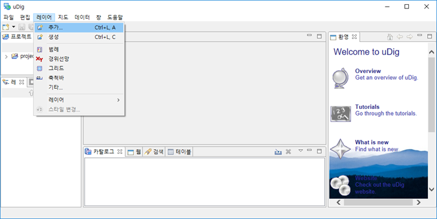
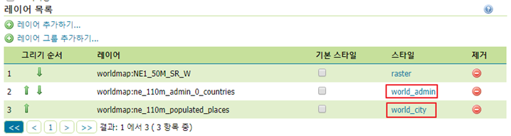
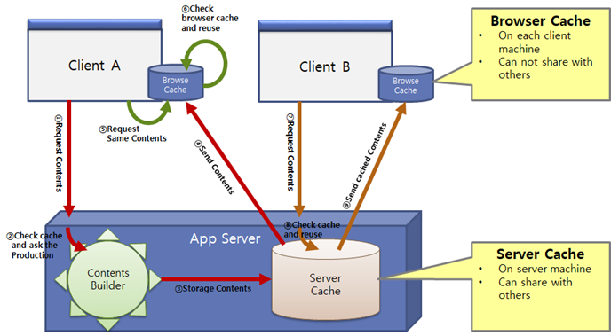

# 공간데이터 배포 (GeoServer)

> 인터넷에 공간정보를 서비스하는 GeoServer에 대해 배워보겠습니다.

- [GeoServer 에 레이어 등록](#GeoServer-에-레이어-등록)
- [OGC 웹서비스 이해](#OGC-웹서비스-이해)
- [레이어 그룹과 스타일](#레이어-그룹과-스타일)
- [uDig을 이용한 순쉬운 스타일링](#uDig을-이용한-순쉬운-스타일링)
- [GWC를 이용한 캐시](#GWC를-이용한-캐시)

<br/>

## GeoServer 에 레이어 등록

우선 무작정 데이터를 등록해 봅시다. [GeoServer](http://geoserver.org)가 없다면 설치하세요.

GeoServer를 실행해 주세요. [시작] 버튼을 누르시고, GeoServer 안의 Start GeoServer를 선택하시면 시작됩니다. 혹시 서비스로 설치하신 분은 자동으로 시작되어 있을 것입니다.

웹브라우저를 띄우시고 다음 주소로 갑니다. http://localhost:8080/geoserver

로그인 해 주세요. 설치 시 바꾸지 않으셨다면 `username: admin, password: geoserver` 입니다.

`Layer Preview` 메뉴에 들어가보면 미리 등록된 여러 레이어들을 볼 수 있습니다. 이 레이어들은 인터넷 상에 공간정보를 서비스할 준비가 되어 있는 것입니다.

GeoServer가 깔린 폴더에 있는 `data_dir` 폴더 아래의 `data` 폴더에 `worldmap` 이란 폴더를 만들어 주세요. 압축된 파일에서 다음 3개 레이어를 이 worldmap 폴더에 복사해 주세요. ESRI Shape 파일의 경우 이름이 같은 파일들을 모두 복사해야 함을 잊지 마세요.

- NE1_50M_SR_W.tif   
- ne_110m_admin_0_countries.shp   
- ne_110m_populated_places.shp

이제 GeoServer에서 이 레이어들을 등록해 보겠습니다. GeoServer에 레이어를 등록하는 과정은 일반적으로 다음과 같은 과정을 거칩니다.

1. 작업공간 만들기
2. 저장소 만들기
3. 레이어 만들기

'작업공간'은 보통 프로젝트가 새로 시작될 때 한번씩만 만들어 주면 됩니다.

웹브라우저에 띄워놓은 GeoServer 관리화면에서 '데이터-작업공간' 메뉴를 선택합니다. '새로운 작업공간 추가하기' 버튼을 누릅니다.

Name에 worldmap, 네임스페이스 URI에 `http://myservice.com` 을 입력하고, 기본 작업공간으로 설정하기에 체크 후 '저장'을 누릅니다.

네임스페이스 URI에 지금은 아무 웹주소나 넣은 것이지만, 원래 공간정보를 서비스 하는 웹사이트 주소를 넣어주어야 합니다. 이 정보는 메타데이터로 사용자에게 전달됩니다.

이제 저장소을 만들겠습니다.

관리화면에서 '저장소' 메뉴를 선택하고, [새로운 저장소 생성하기] 버튼을 누릅니다.
 
먼저 `Directory of spatial files (shapefiles)`를 선택해 ESRI Shape 파일이 있는 폴더를 저장소로 만들어 봅시다.
 
데이터 저장소 이름에 'worldmap_shape' 입력 후, Shapefile을 포함한 디렉토리 위치의 '탐색' 버튼 눌러 'data/worldmap' 폴더 선택하고, DBF 문자셋으로 `UTF-8`을 선택하고 '저장'을 누릅니다. 만일 `cp949`로 된 한글이 있는 경우 문자셋에 `x-windows-949`를 선택하시면 됩니다.   


자동으로 '새로운 레이어' 화면으로 전환되네요. '발행하기' 링크를 눌러 `ne_110m_admin_0_countries` 레이어 부터 만들어 봅시다. 여기서 '발행하기'란 것은 영어로는 publish로 서버 안의 자료를 인터넷으로 내보낸다는 의미를 가지고 있습니다.

'발행하기' 링크를 누르면 옵션이 매우 많은 '새로운 레이어' 화면으로 넘어갑니다.

여기서 꼭 3가지 값을 확인해야 합니다.
1. 정의한 좌표체계
    - 데이터의 좌표계를 지정하는 부분입니다.
    - 자동으로 지정되는 경우도 있지만 안 그런 경우도 많습니다.
    - 실제 자료의 좌표계와 일치하게 지정해야 합니다.
2. 원본 데이터 최소경계 영역
    - 보통 최초에는 비어 있습니다.
    - '데이터로부터 계산하기' 링크를 누르면 자동으로 값이 지정됩니다.
3. 위/경도 영역
    - 정의한 좌표체계의 원본 데이터 최소경계 영역을 경위도로 바꾼 값입니다.
    - 보통 최초에는 비어 있습니다.
    - '원본 영역으로부터 계산하기' 링크를 누르면 자동으로 값이 지정됩니다.


HTTP 설정 부분의 '응답 캐시 헤더'는 HTTP 규약에 따라 이미지 등 컨텐츠를 웹브라우저가 얼마동안 캐시를 하게 할지 설정하는 헤더를 붙일지를 결정하는 옵션입니다. ‘응답 캐시 해더’ 선택을 체크합니다. 그 아래 있는 값인 캐시시간이 얼마나 캐시가 지속될지 시간을 초단위로 나타낸 것입니다. 이 캐시시간을 `31536000`로 지정한 것은 `60(초) * 60(분) * 24(시간) * 365(일)` 한 값으로 1년을 의미합니다.   


그리고 보통 이 화면에서 바꿔 주어야 할 것이 WMS 설정 부분의 기본 스타일입니다. 우리는 국가 경계를 선으로 나타내 아래의 영상이 보이게 할 것이니 일단 `line`을 선택합니다. 여기서 주의 할 것이 아래에 있는 사용 가능한 스타일 목록에서 선택을 바꾸는 것이 아니라 기본 스타일에서 바꿔야 한다는 것입니다.

이제 화면 제일 하단의 '저장'을 눌러 저장합니다.

잘 발행되었는지 '레이어 미리보기' 메뉴로 가서 확인해 봅시다.
`ne_110m_admin_0_countries` 레이어를 찾아 'OpenLayers' 링크를 누르면 동적으로 이동/확대 가능한 지도로 표시됩니다.   


이제 나머지 레이어도 등록하기 위해서 [레이어] 메뉴를 누르고 [새로운 레이어 추가하기] 버튼을 누릅니다. 저장소로 `worldmap:worldmap_shape` 을 선택하고 아직 미발행 상태인 `ne_110m_populated_places` 레이어의 [발행하기] 링크를 누릅니다.

정의한 좌표계 부분의 값을 확인하고, [데이터로부터 계산하기], [원본 영역으로부터 계산하기]를 누릅니다.

[발행] 탭으로 가서 응답 캐시 헤더를 켜고, 캐시 시간으로 31536000을 입력합니다. 기본 스타일은 ‘poi’를 선택합니다.

[저장]을 눌러 저장합니다. [레이어 미리보기] 메뉴를 누르고 레이어를 찾아 미리보기를 합니다.   


이제 래스터 데이터를 등록해 보겠습니다.

래스터 데이터는 각 파일을 하나씩의 저장소를 만들어 주어야 합니다.
[저장소] 메뉴를 선택하시고, [새로운 저장소 생성하기] 버튼을 누릅니다.

[GeoTIFF] 링크를 누릅니다.
 
URL 부분에서 [탐색…] 버튼을 누르고, 'data/worldmap/NE1_50M_SR_W.tif' 파일을 선택합니다. 데이터 저장소 이름에 'NE1_50M_SR_W'를 입력하고 [저장] 버튼을 눌러 완료합니다.

새로운 레이어 화면에서 [발행하기] 링크를 누릅니다. 정의한 좌표체계, 원본 데이터 최소경계 영역, 위/경도 영역을 확인합니다.

[발행] 탭을 누르고, 응답 캐시 헤더에 체크하고 캐시 시간에 31536000 입력하고 [저장]을 누릅니다.

[레이어 미리보기]에서 레이어를 찾아 미리보기 합니다.   


</br>

## OGC 웹서비스 이해

지금 배우고 있는 GeoServer의 역할을 한 문장으로 기술하면 다음과 같습니다.

***Geospatial Gateway Server***

다양한 공간 Data를 인터넷용 공간데이터 표준 인터페이스로 공급하는 프로그램이란 뜻입니다.   


GeoServer가 제공하는 대표적인 공간정보 표준 인터페이스에는 WMS,  WFS, WCS 등이 있습니다. 이 인터페이스를 통해 컴퓨터에 저장된 벡터 데이터와 래스터 데이터를 인터넷 상에서 활용하기 적합한 형태로 바꿔 서비스 해 줍니다.

벡터 데이터는 WMS와 WFS로 서비스 될 수 있고, 래스터 데이터는 WMS와 WCS로 서비스 될 수 있습니다.

이런 서비스 표준을 정한 기관이 OGC(Open Geospatial Consortium)입니다. 그래서 통칭해 OGC Web Service(OWS), 우리말로 OGC 웹서비스라 합니다.

이제 서비스 인터페이스를 중심으로 하나씩 살펴보겠습니다.

### ⬛ Web Map Service (WMS)

- 지도 이미지 등 스타일을 가진 공간데이터를 인터넷으로 서비스하는 표준입니다.
- 요청방법과 응답형식을 정의하고 있습니다.
- 보통 URI(웹주소+파라미터)로 요청하고 이미지로 응답을 받습니다.
- 지도요청, 카타로그조회, 속성조회 등이 가능합니다.
- 필수: GetCapabilities , GetMap 
- 옵션: GetFeatureInfo, DescribeLayer, GetLegendGraphic   
https://openlayers.org/en/latest/examples/wms-tiled.html


### ⬛ Web Feature Service (WFS)

- 벡터 형식의 공간정보 피처(Feature: Geometry+attribute)를 인터넷으로 서비스하는 표준입니다.
- 요청방법과 응답형식을 정의하고 있습니다.
- 보통 URI로 요청하고 XML, GeoJSON 등으로 응답을 받습니다.
- 피처요청, 카타로그조회, 속성조회 등이 가능합니다.
- 필수: GetCapabilities , DescribeFeatureType , GetFeature
- 옵션: LockFeature, Transaction   
https://openlayers.org/en/latest/examples/vector-wfs.html


### ⬛ Web Coverage Service (WCS)

- 래스터 형태의 커버리지(좌표가 있는 래스터) 공간데이터를 인터넷으로 서비스하
는 표준입니다.
- 요청방법과 응답형식을 정의하고 있습니다.
- 보통 URI로 요청하고 래스터 파일로 응답을 받습니다.
- 커버리지요청, 카타로그조회 등이 가능가능합니다.
- 필수: GetCapabilities , DescribeCoverage , GetCoverage   
http://demo.mapserver.org/cgi-bin/wcs?SERVICE=wcs&VERSION=1.0.0&REQUEST=GetCoverage&COVERAGE=modis-001&CRS=EPSG:26915&BBOX=159707,4597395,1400707,5501395&WIDTH=400&HEIGHT=300&FORMAT=GEOTIFF_RGB  

<br/>

## 레이어 그룹과 스타일

앞에서 실습한 각각의 레이어들은 이제 인터넷에 서비스 되어 인터넷 연결만 되면 어디서든 불러서 활용할 수 있는 상태가 되었습니다. 이제 하나의 그룹으로 만들어 보겠습니다.

GeoServer 관리자 화면에서 [레이어 그룹] 메뉴를 선택하고 [새로운 레이어 그룹 생성하기] 버튼을 누릅니다.

[데이터] 탭에서 [레이어 추가하기…] 버튼을 눌러 NE1_50M_SR_W, ne_110m_admin_0_countries, ne_110m_populated_places 레이어들을 차례로 추가합니다. [데이터 최소경계 영역 계산하기] 버튼을 눌러 영역 값을 입력합니다.
이름에 ‘worldmap’을 입력하고 [저장]을 누릅니다.   


[레이어 미리보기] 메뉴로 가서 worldmap 그룹을 지도로 봅시다.   


지도의 스타일은 [스타일] 메뉴와 [레이어] 메뉴의 레이어 편집에서 [발행] 탭의 WMS 설정의 기본 스타일 부분을 조합해서 관리하게 됩니다.

먼저 국가경계를 진한 회색으로 바꾸고, 국가명도 표시해 보겠습니다.

[스타일] 메뉴로 가셔서 [새로운 스타일 추가하기…] 버튼을 선택합니다.
 
스타일 이름으로 world_admin 을 입력하고, 기본 스타일로 부터 복사합니다. 아래 콤보박스에서 Line을 선택 후, [복사하기…] 링크를 누릅니다. 스타일 편집기에서 stroke 부분을 찾아 그 뒤의 값을 #888888 으로 바꾸고 [제출]을 눌러 world_admin  스타일 만들기를 끝냅니다.   


[레이어] 메뉴를 선택하고, ne_110m_admin_0_countries 레이어를 찾아 선택하여 ‘레이어 편집’ 화면으로 갑니다.

[발행] 탭을 선택하고 WMS 설정 부분에서 기본스타일을 world_admin으로 바꿉니다. [저장]을 눌러 변경사항을 저장합니다.

[레이어 미리보기]로 가서 ne_110m_admin_0_countries 레이어를 미리보기 합니다. 색상이 안 변했다면, 이것은 캐시의 부작용입니다. 더 확대해 보면 회색 선으로 보이는데 처음 화면은 아무리 새로고침을 해도 파란 선으로 보이네요.
 
Chrome에서 [F12]를 눌러 개발자 도구를 띄우고, 새로고침 버튼을 길게 누르면 추가 기능들이 나옵니다. 여기서 강력 새로고침 메뉴를 선택하면 캐시를 지우고 다시 불러옵니다. 이제 첫 화면부터 회색 선으로 보입니다.

지도 스타일과 관련해서 다음 경로에서 좋은 샘플들을 많이 찾을 수 있습니다.   
http://docs.geoserver.org/stable/en/user/styling/sld/cookbook

SLD Cookbook에서 목차에 있는 Polygons 항목을 선택해 이동합니다. 그림들을 주욱 보며 아~ 저런 표현들도 가능하구나 하다 보니 글자가 폴리곤 중심에 찍혀 있는 그림이 보이네요. 조금 더 내리는 `Label Halo` 부분에 글자가 찍히고 주변에 테두리까지 있는 예제가 보입니다.

XML 부분을 모두 복사합니다.

다시 GeoServer 관리자 화면으로 가서 [스타일] 메뉴를 선택합니다. world_admin 스타일을 선택하고 스타일 편집기에서 17~28 행의 부분을 복사한 텍스트로 바꿉니다. `stroke` 값은 `#888888` 으로 바꾸고 `<Fill> … </Fill>` 부분은 삭제합니다.

`<ogc:PropertyName>` 의 값을 `ADMIN`으로 수정 후 [제출] 합니다.

이제 미리보기 화면으로 돌아와 화면을 움직여 보면, 다음과 같이 회색선에 나라 이름이 나옴을 확인할 수 있습니다.   


폴리곤의 중앙에 나라이름이 오게 하고 폰트는 ‘맑은 고딕’으로 바꾸고 싶습니다.

SLD Cookbook으로 다시 가서 Polygon 스타일의 좀 더 아래 부분을 보니 'Polygon with styled label' 부분에 그나마 마음에 드는 예제가 있습니다.
이 예제의 코드 부분에서 `<Font>` 부분과 `<LabelPlacement>` 부분을 복사해 옵니다.

GeoServer 관리자 화면으로 와서 [스타일] 메뉴에서 world_admin 스타일을 선택해 다시 편집합니다. `</Halo>` 다음에 복사해온 내용을 붙여 넣고, font-family 값을 '맑은 고딕'으로 바꿉니다.
font-size 값은 '13'으로 바꿉니다.
스타일 편집기의 XML 중 첫행에 있는 encoding 값을 `CP949`로 바꿉니다.
[적용하기]를 눌러 반영합니다.

이 때 encoding 값을 CP949로 바꾸는 것은 GeoServer의 버그에 대응하기 위한 일종의 꽁수입니다. 언젠가는 수정되어 다른 방법으로 대응해야 할 지도 모릅니다. 현재는 한글이 SLD에 들어갈 경우 이렇게 대응할 수 밖에 없습니다.   


GeoServer가 사용하고 있는 SLD(Styled Layer Descriptor)는 역시 OGC가 지정한 국제 표준이며, 기술적인 면에서 지도표현에 필요한 내용을 아주 상세히 정의할 수 있습니다.

하지만 지금 해 보셨다시피 이 복잡한 문서를 사람 손으로 수정하는 것이 결코 만만한 작업은 아닙니다. 그래도 처음부터 만들라면 못 하지만, 이미 있는 예를 보고 살짝씩 수정하는 것은 할만 합니다.

SLD에 대한 자세한 정보는 다음 링크를 참조하세요.   
http://docs.geoserver.org/stable/en/user/styling/sld/reference/index.html#sld-reference

</br>

## uDig을 이용한 순쉬운 스타일링

이번 시간에는 앞에서 만들었던 SLD를 좀더 손쉽게 시각적인 도구를 이용하여 만드는 방법을 익히도록 하겠습니다.

국제 표준이기에 SLD를 지원하는 툴은 많고, 우리가 흔히 사용하는 QGIS에서도 SLD를 읽고 만들 수 있습니다. 하지만 아쉽게도 QGIS에서 만든 SLD는 GeoServer에서는 잘 적용되지 않습니다. 이것은 QGIS나 GeoServer가 표준을 지키지 않아 생기는 것이 아니라, 똑같은 웹페이지도 웹브라우저에 따라 조금씩 달리 보이는 것 처럼 각 프로그램에 어느정도 구현의 자유가 있기 때문입니다.
그래서 GeoServer를 위한 SLD를 가장 잘 다루는 툴은, GeoTools를 핵심 엔진으로 사용하는 uDig 입니다.

uDig은 좋은 데스크탑 GIS 프로그램입니다. 하지만, 다른 유명 오픈소스 GIS 프로그램들에 비하면 약간 덜 다듬어져 보입니다. 다른 툴들에 비해 속도가 좀 늦은 편입니다.

uDig을 실행하고 [레이어 - 추가…] 메뉴를 선택합니다.   


데이터 원본 중 파일 항목을 선택하고 [다음>] 버튼을 누릅니다.

GeoServer의 'data_dir' 폴더로 가서 'data/worldmap' 폴더 안의 3개 자료를 모두 선택하고 [열기] 버튼을 누릅니다.

주요도시 포인트를 꾸며 보겠습니다.

포인트 레이어를 선택하고 [스타일 변경…]을 선택합니다. 포인트의 형태를 Circle, 크기 7, 선색으로 갈색 계열 색, 채움색에 밝은 노란색선택합니다.
레이블에 NAME 선택하고, 맑은 고딕 10포인트, 헤일로 밝은 노랑 두께 1 기준위치 middle, right 선택합니다.

[적용]을 누르고 지도를 보면서 원하는 모습이 나올 때까지 조정합니다.   

 
심볼을 다 조정했으면, [내보내기] 버튼을 눌러 'world_city.sld'로 c:\data 폴더에 저장합니다.

이제 다시 GeoServer 관리자 화면으로 갑니다.   
http://localhost:8080/geoserver 

[스타일] 메뉴를 선택하고, [새로운 스타일 추가하기 버튼을 누릅니다.
스타일 파일을 업로드 합니다. 아래의 [파일 선택] 버튼을 누르고, 조금 전에 저장한 'world_city.sld' 파일을 선택합니다.

[업로드…] 버튼을 누르면 SLD 파일이 읽혀져 스타일 편집기에 들어옵니다.

한글이 다 깨져 보이네요.   


첫 줄의 encoding을 “CP949”로 바꾸고 Name 부분의 한글이 깨진 곳을 world_city로 바꿉니다. font-family 값을 ‘맑은 고딕’으로 바꾸고 [제출] 을 눌러 저장합니다.

[레이어] 메뉴로 가서 ne_110m_populated_places 레이어를 선택합니다.
[발행] 탭을 선택하고 기본 스타일을 world_city로 바꾸고 [저장] 합니다.

[레이어 미리보기]로 가서 ne_110m_populated_places 레이어를 확인합니다.
 
이제 [레이어 미리보기]로 가서 worldmap 레이어 그룹을 확인해 보면 조금 이상한 현상이 보입니다.

열심히 심볼을 빠꿨는대 아직 모든 레이어가 그대로네요.   


이는 그룹 레이어인 경우 처음에 그룹 레이어를 만들 때 지정된 기본 스타일을 기억하고 있기 때문입니다. 이를 바꿔주어야 합니다.

[레이어 그룹] 메뉴를 선택하고, worldmap 레이어 그룹을  선택합니다.
worldmap:ne_110m_admin_0_countries 레이어의 스타일로 world_admin,
worldmap:ne_110m_populated_places 레이어의 스타일로 world_city를 선택하고 [저장]을 누릅니다.   
 

아까 띄워 놓은 worldmap 레이어 그룹의 미리보기 화면에 가서 화면을 이동하면 이제 심볼이 바뀌어 보입니다.   


어느 정도 확대된 정도까지만 도시들이 표시 되도록 '축척제어'를 적용하겠습니다. 이 때 중요한 정보가 미리보기 화면 좌하단에 있습니다. 현재 축척이 1 : 17M, 즉 1 : 17,000,000 이네요. 1 : 20,000,000 부터는 도시들이 사라지게 설정하겠습니다.   


[스타일] 메뉴로 가, world_city 스타일을 선택하고, 스타일 편집기에서 `<sld:PointSymbolyzer>`가 시작하는 부분을 찾아 그 앞에 다음 행을 넣어 줍니다.   

```xml
<sld:MaxScaleDenominator>20000000</sld:MaxScaleDenominator>
```


그리고 [제출] 하시면 Point 들이 보이게 될 최소 축척의 지정이 끝납니다.   


<br/>

## GWC를 이용한 캐시

우리가 지금까지 무심코 사용했던 GeoServer가 제공하는 레이어 미리보기 기능에는 생각보다 많은 기능이 들어있습니다. 화면의 크기를 바꿀 수도 있고, 받아올 이미지의 포맷도 변경할 수 있고, WMS 버전 등의 상세한 정보도 바꿔 줄 수 있으며, 심지어 받아올 객체의 조건을 주는 것 까지도 가능합니다. 이번에 배워볼 캐시와 관련된 중요한 기능인 타일 형태로 지도를 불러오는 방법도 여기서 지정 가능합니다.

현재 미리보기 화면을 크롬의 개발자 도구에서 네트워크 분석 해 보면 지도 전체를 한 장의 이미지로 받아오고 있는 것을 확인할 수 있습니다.   
 

이렇게 웹페이지의 지도 부분에 들어갈 이미지를 한 장으로 받아오는 것은 캐시라는 측면에서 불리한 면이 있습니다. 보통 지도화면은 웹 페이지의 크기 변화에 따라 자연스럽게 변화하고, 그러면 지도화면에 가득 차는 지도 이미지의 크기도 바뀌게 됩니다.

이렇게 크기가 바뀌면 웹 브라우저 입장에서는 똑같은 지도 이미지가 아니라 다른 컨텐츠이기에 서버에 다시 요청해야 하고, 그러면 서버인 GeoServer는 거의 같은 그림을 다시 그려야만 합니다.

레이어 미리보기 화면의 오른쪽 상단에 있는 [...] 버튼을 선택하면 여러가지 옵션을 지정할 수 있도록 확장되는데 이 중 Width/Height를 600/600으로 바꿔 봅시다.
 
이제야 우리를 괴롭히던 강력한 캐시 효과에서 벗어나 드디어 지도가 바꾼 스타일로 변경되었네요. 지도 이미지는 여전히 하나의 통 이미지로 오고 있습니다.  


이제 Tiling 항목을 Single Tile에서 Tiled 로 바꿔 봅시다.
 
지도 화면에 변화가 없는 것 처럼 보이지만, 네트워크 분석을 보면 4장의 256*256 크기의 타일로 분할되어 지도 이미지가 옴을 알 수 있습니다.
심지어 화면 크기가 `600*600`인데 `256*256`크기의 타일 4장만 왔습니다.   


그럼 좀 비는 나머지 이미지 부분은 어떻게 처리된 것일까요? 태평양에 있는 날짜변경선에서 나뉘어진 타일이 오른쪽 왼쪽으로 재사용 된 것입니다.

지도를 좀 더 확대해 보면 더 많은 타일들이 오는 것을 확인하실 수 있습니다.
그런데 중요한 것은 이런 타일들이 잘리는 자리가 항상 같다는 것입니다.
때문에 이 타일들을 캐시해서 재활용 하면, 웹페이지의 크기가 바뀌어 지도 크기가 바뀌어도 캐시된 자료를 그냥 사용할 수 있어 매우 효율적입니다.
 
이렇게 타일들이 잘리는 자리를 전 지구적으로 명확히 정의해 놓은 것을 그리드셋 이라고 합니다.   


이런 지도 타일을 이용한 캐시 기법은 단지 나의 웹브라우저의 캐시에만 효율적인 것이 아니라, 서버 차원에서도 누가 요청하던 미리 만들어 둔 지도 타일이 있는 경우 다시 만들지 않고 이를 서비스에 사용할 수 있다는 커다란 장점이 있습니다.   

 
지도 타일 같은 웹 컨텐츠의 캐시 방법은 HTTP가 설계 될때 이미 잘 설계되어 지금도 이 규칙을 그대로 사용중입니다. 이 규칙에 따라 각 클라이언트와 서버의 캐시가 어찌 생산되고 활용될지가 결정되고, 이에 따라 엄청난 속도 차이를 보이게 됩니다.   

 

간혹 왜 브라우저 캐시가 있는데 불필요하게 서버 캐시를 또 만드냐고 하는 분이 있는데, 이는 내 동료의 브라우저에 있는 캐시를 내가 쓸 수 있다면, 보안적으로 문제가 되기 때문이라 할 수 있습니다. 하지만, 동료를 주기 위해 만들었던 캐시를 내가 서버에서 다시 받아 사용하는 것은 아무런 문제도 되지 않습니다.
단지 서버가 두번 일하지 않게 해 줄 수 있을 뿐이지요. 가장 안정적이고 좋은 서버는, 거의 일을 하지 않는 서버입니다. 이런 철학으로 만든 서비스는 아주 훌륭한 속도와 성능을 보입니다.

이제 GeoServer 관리화면에서 캐시를 관리하는 방법을 배워 보겠습니다.

메뉴의 아랫쪽을 보면 타일캐시 그룹이 있습니다. GeoServer의 타일캐시 그룹에 있는 설정들은 모두 서버캐시에 관한 설정입니다. 브라우저 캐시를 위한 설정은 이미 우리가 레이어를 만들때 배웠었습니다. 캐시 헤더 설정 부분이 바로 그것입니다.

GeoServer에서 지원하는 지도타일 서버캐시를 GeoWebCache 줄여서 GWC라 많이 부릅니다. 서버캐시 설정을 위해 먼저 [캐시 기본 설정] 메뉴를 먼저 눌러보겠습니다. 이 중에서 꼭 살펴봐야 할 부분이 '기본 타일 이미지 포맷' 부분과 그리드셋 부분입니다.
 
기본적으로 jpg와 png 포맷의 이미지만 캐시가 되도록 되어 있습니다. 이것은 gif, tif 등으로 요청시 서버캐시를 타지 않는다는 의미입니다.   


가장 아래 부분을 보면 ‘기본 캐시된 그리드셋’ 이라는 부분이 있습니다. 
아까 말했던 타일이 잘리는 자리인 그리드셋이 바로 이것입니다. 그리드셋은 보통 좌표계마다 정의되고 기본적으로 EPSG:4326(경위도)와 EPSG:900913(구글좌표계 혹은 메르카토르 좌표계, 정식명칭 EPSG:3857)좌표계에 대한 그리드셋이 정의되어 있습니다. 때문에 기본적으로는 경위도와 구글좌표계로 요청하는 타일들만 서버캐시가 생성됩니다.   

 
이런 기본 좌표계를 쓰지 않는 지도들을 타일로 캐시하려면, [그리드셋] 메뉴를 이용해 직접 정의해 줄 수 있습니다. 하지만, 이는 입문과정 수업 범위를 벗어납니다.

추가적으로 볼 메뉴는 [타일레이어] 메뉴입니다. 여기서 레이어와 좌표계를 선택해 타일형태로 요청되는 지도들을 미리보기 해볼 수도 있고, 캐시를 미리 생성하거나 지울 수 있고, 각 레이어별 캐시 할당량을 지정할 수도 있습니다.

보통 이 화면에서 가장 많이 하는 작업은 이용률이 많을 것으로 예상되는 레이어의 캐시를 미리 만들어 두는 작업입니다.   

 
앞의 예에서도 보았듯이 GeoServer는 강력한 좌표계 변환기능이 있어서 벡터, 래스터 혹은 모두 합쳐진 지도를 실시간 좌표변환 해 줄 수 있습니다.

하지만, 실시간 좌표계 변환 기능은 매우 부하가 큰 기능입니다. 때문에 상용 서비스에서는 가능한 한 서비스할 좌표계로 모든 자료를 변환해 놓고 좌표계 변환 없이 서비스 될 수 있도록 해 줍니다.

<br/>

다음 OpenLayers 과제에 도전해 보세요.

- 우리가 발행한 `worldmap:worldmap` 레이어 그룹을 WMS로 조회하는 WebGIS를 구현해보세요.
- `worldmap:worldmap` 레이어 그룹 GWC로 조회하는 WebGIS를 구현해보세요.
- 우리가 발행한 `worldmap:ne_110m_admin_0_countries` 레이어를 WFS로 조회하는 WebGIS를 구현해보세요

<br/>

## 서비스를 위한 Stack 구성

상용 환경에서 웹 지도 서비스를 위한 일반적인 구성은 아래 그림과 같습니다.   

 
OpenLayers를 지도 콘트롤로 하는 웹페이지가 웹서버를 통해 서비스에 접근하고, 웹서버는 정적인 HTML 데이터를 제공하고, 공간정보는 Proxy HTTP 모듈을 통해 GeoServer에 요청합니다. 이 때 사용자의 인터넷을 통한 요청은 80포트로 통합되어 서비스 됩니다.

GeoServer는 공간정보 파일이나 PostGIS에서 데이터를 가져와 서비스를 해 줍니다.
이 때 공간정보는 QGIS 등 데스크탑 GIS 툴을 이용해 가공하고 관리합니다.

이런 서비스 스택의 구성을 이제 거의 다 배웠습니다. 아직 안 배운 것이 웹서비스를 통해 여러가지 서비스를 80포트로 통합하는 것입니다. 이런 기법은 보안정책 준수와 Cross Domain 오류 극복을 위해 필요합니다.

많이 사용되는 웹서버인 Apache HTTPD를 설치해 봅시다.   
https://www.apachelounge.com/download

Apache 2.4의 win64용 zip 파일을 받아 C:\Apache24 폴더에 압축풀어 주는 것만으로 설치는 끝납니다. 이 때 Apache24 폴더가 2중으로 생기지 않게 주의해 주세요, 
만약 다른 경로에 설치하려면 설정파일을 여기저기 수정해 주어야 하는 불편함이 있습니다.

잘 설치되었는지 확인하기 위해 C:\Apache24\bin\httpd.exe 파일을 실행 후  웹브라우저를 띄우고 http://localhost 에 들어가 봅시다.  


이제 Apache HTTPD와 GeoServer의 연결을 위해 설정파일을 수정해 주어야 합니다.

Apache HTTPD의 설정 파일은 conf/httpd.conf 파일입니다. 이 파일의 설정으로 웹서버의 거의 모든 동작을 제어할 수 있는 아주 중요한 파일입니다. 이제 우리 목적에 맞게 수정할 것인데, 그 전에 꼭 원본을 복사해 두세요. 만약 실수로 이 설정파일이 잘못되면 웹서비스가 구동하지 않게 되기에 이렇게 수정 전에 복사해 두는 습관을 들이는 것이 좋습니다.

Code Editor로 httpd.conf 파일을 엽니다.
 
먼저 필요한 모듈들을 활성화 시켜야 하는데 `mod_proxy.so`, `mod_proxy_http.so` 2개 모듈을 찾아 앞의 주석마크(#)을 삭제해 활성화합니다. 이 때 간혹 실수로 mod_proxy_html.so 모듈을 실행시키는 분이 있으니 주의하세요.

이제 mod_proxy_http 모듈의 동작 설정을 해 주어야 합니다. httpd.conf 파일의 제일 마지막에 다음 내용을 추가해 줍니다.

```xml
<IfModule proxy_http_module>
ProxyPass /geoserver http://localhost:8080/geoserver
ProxyPassReverse /geoserver http://localhost:8080/geoserver
</IfModule>
```

내용은 외부에서 http로 /geoserver 라는 내용이 들어오면 이를 내부적으로 http://localhost:8080/geoserver 라는 경로로 바꿔주고, 내부에서 나가는 내용에 http://localhost:8080/geoserver 라는 내용이 있으면 /geoserver로 바꿔 내보내 주라는 것입니다.

잘 되는지 확인해 보기 위해 httpd를 종료하고 다시 시작해 봅시다.
그리고 http://localhost/geoserver 를 호출해 봅시다.   

 
이렇게 `:8080` 포트 지정 없이 geoserver를 호출할 수 있으면 성공입니다.
이제 웹 포트인 80 포트로 GeoServer까지 통합된 것입니다. PostGIS는 GeoServer를 통해 연결할 수 있으니 우리가 원하는 스택을 모두 구성하였습니다.

이제 우리 WebGIS를 80 웹 포트로 연결하여 이 폴더를 웹서비스에서 볼 수 있도록 설정해 보겠습니다.

DocumentRoot 로 지정된 폴더에 심볼릭 링크를 만들면, 여러 폴더를 통합해 줄 수 있습니다. httpd.conf 파일에서 DocumentRoot 부분을 수정해 HTML의 루트 경로를 바꿀 수도 있지만, 그보다는 심볼릭 링크를 이용하는 것이 여러 폴더를 체계적으로 관리하는데 유리합니다.

콘솔창을 실해하여 cd 명령으로 \Apache24\htdocs 폴더로 갑니다.

윈도우에서 심볼릭 링크를 만들 수 있는 명령인 mklink를 이용해 심볼릭 링크를 생성해 줍니다. 

    mklink /D olExam c:\temp\olExam 

cd 명령으로 olExam 폴더로 갑니다.
들어가지고 dir 명령으로 내용을 확인할 수 있으면 성공입니다.

http://localhost 를 호출해 확인해 봅시다.

<br/><br/>

The End