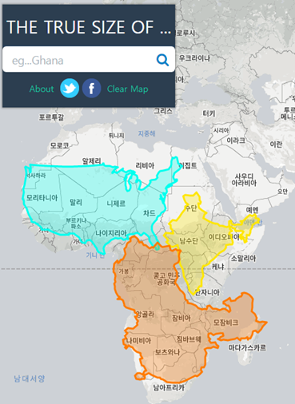

# 오픈소스 GIS 서비스 개발자 (입문)

> (출처) '오픈소스 GIS 서비스 개발자 입문' 과정, [공간정보아카데미](http://lxsiedu.or.kr), [OSGeo한국어지부](https://www.osgeo.kr)   
본 자료는 모두 Creative Commons License CC-BY-NC을 따릅니다.    
본 교재에서 사용하는 샘플 데이터 셋은 실제 정보와 다르므로 교육용 이외에는 사용할 수 없습니다.

 

본 교육은 `The True Size of… `(https://thetruesize.com) 와 유사한 사이트를 처음부터 끝까지 `Open Source GIS`로 만들어 보는 것입니다.

 

 

- [오픈소스 GIS 알아보기](Lecture1-FOSS4G.md)
- [공간데이터 다루기 (QGIS)](Lecture2-GeoData.md)
- 공간 DBMS 구축 (PostGIS)
- [공간데이터 배포 (GeoServer)](Lecture5-GeoServer.md)
- [웹 GIS 서비스 구현 (OpenLayers)](Lecture6-OpenLayers.md)

이렇게 데이터부터 웹까지, 공간정보 웹 서비스에 필요한 내용을 사례중심으로 전부 훑어 보는 것이 본 과정의 목표입니다. 더 자세한 기술적인 정보가 필요하신 분은 심화과정을 들어주세요.

 

  

The End